**Question 1:**
Many CPU-scheduling algorithms are parameterized. For example, the RR algorithm requires a parameter to indicate the time slice. Multilevel feedback queues require parameters to define the number of queues, the scheduling algorithms for each queue, the criteria used to move processes between queues, and so on. These algorithms are thus really sets of algorithms (for example, the set of RR algorithms for all time slices, and so on). One set of algorithms may include another (for example, the FCFS algorithm is the RR algorithm with an infinite time quantum). What (if any) relation holds between the following pairs of algorithm sets?
a. Priority and SJF
b. Multilevel feedback queues and FCFS
c. Priority and FCFS
d. RR and SJF

**Answer 1:**
Here is the relationship between the given pairs of algorithm sets:

a. **Priority and SJF (Shortest Job First)**
The SJF algorithm is a special case of the priority scheduling algorithm. In SJF, the "priority" of a process is the inverse of its predicted next CPU burst time. The process with the shortest burst time gets the highest priority. Therefore, the set of SJF algorithms is a subset of the set of priority algorithms.

b. **Multilevel feedback queues and FCFS (First-Come, First-Served)**
The FCFS algorithm is a special case of the multilevel feedback queue algorithm. A multilevel feedback queue can be configured to act as a simple FCFS scheduler by using only one queue and setting the scheduling algorithm for that queue to FCFS. Therefore, the set of FCFS algorithms is a subset of the set of multilevel feedback queue algorithms.

c. **Priority and FCFS (First-Come, First-Served)**
The FCFS algorithm can be considered a special case of the priority scheduling algorithm. In this case, the priority is based on the process's arrival time; the earlier a process arrives, the higher its priority. Therefore, the set of FCFS algorithms is a subset of the set of priority algorithms.

d. **RR (Round Robin) and SJF (Shortest Job First)**
These two sets of algorithms are distinct. RR scheduling focuses on providing good response time by giving each process a small time slice (quantum) of CPU time in a rotating fashion. SJF focuses on maximizing throughput and minimizing waiting time by scheduling the process with the smallest estimated execution time. There is no direct relation where one is a specific parameterization of the other.

-----

**Question 2:**
Find the average waiting time (A.W.T) and (A.T.A.T) for executing the following process using Preemptive short-job first.

| Process | Burst time | Arrival time |
| :--- | :--- | :--- |
| P1 | 5 | 2 |
| P2 | 13 | 3 |
| P3 | 8 | 0 |
| P4 | 4 | 5 |
| P5 | 10 | 1 |

**Answer 2:**
Preemptive Shortest-Job-First is also known as the Shortest-Remaining-Time-First (SRTF) algorithm.

**1. Gantt Chart**

The execution of the processes can be visualized with the following Gantt chart:

```mermaid
gantt
    title SRTF Scheduling
    dateFormat x
    axisFormat %s

    section Execution
    P3          : 0, 2
    P1          : 2, 7
    P4          : 7, 11
    P3          : 11, 17
    P5          : 17, 27
    P2          : 27, 40
```



  * **Time 0:** P3 arrives and starts execution.
  * **Time 1:** P5 arrives. P3's remaining time (7) is less than P5's burst time (10). P3 continues.
  * **Time 2:** P1 arrives. P3's remaining time (6) is greater than P1's burst time (5). P3 is preempted, and P1 starts.
  * **Time 3:** P2 arrives. P1's remaining time (4) is less than P2's burst time (13). P1 continues.
  * **Time 5:** P4 arrives. P1's remaining time (2) is less than P4's burst time (4). P1 continues.
  * **Time 7:** P1 finishes. The ready queue contains P3 (rem=6), P5 (rem=10), P2 (rem=13), and P4 (rem=4). P4 has the shortest remaining time and starts.
  * **Time 11:** P4 finishes. The ready queue contains P3 (rem=6), P5 (rem=10), and P2 (rem=13). P3 starts.
  * **Time 17:** P3 finishes. The ready queue contains P5 (rem=10) and P2 (rem=13). P5 starts.
  * **Time 27:** P5 finishes. P2 is the only process left and it runs to completion.
  * **Time 40:** P2 finishes.

**2. Calculation Table**

| Process | Arrival Time (AT) | Burst Time (BT) | Completion Time (CT) | Turnaround Time (TAT = CT - AT) | Waiting Time (WT = TAT - BT) |
| :--- | :--- | :--- | :--- | :--- | :--- |
| P1 | 2 | 5 | 7 | 5 | 0 |
| P2 | 3 | 13 | 40 | 37 | 24 |
| P3 | 0 | 8 | 17 | 17 | 9 |
| P4 | 5 | 4 | 11 | 6 | 2 |
| P5 | 1 | 10 | 27 | 26 | 16 |
| **Total** | | | | **91** | **51** |

**3. Final Averages**

  * **Average Turnaround Time (A.T.A.T):**
    $A.T.A.T = \frac{\text{Total TAT}}{\text{Number of Processes}} = \frac{91}{5} = 18.2$

  * **Average Waiting Time (A.W.T):**
    $A.W.T = \frac{\text{Total WT}}{\text{Number of Processes}} = \frac{51}{5} = 10.2$

-----

**Question 3:**
Consider three CPU-intensive processes, which require 10, 20 and 30 time units and arrive at times 0, 2 and 6, respectively. How many context switches are needed if the operating system implements a shortest remaining time first scheduling algorithm? Do not count the context switches at time zero and at the end.

**Answer 3:**
Let's name the processes:

  * P1: Arrives at T=0, Burst Time = 10
  * P2: Arrives at T=2, Burst Time = 20
  * P3: Arrives at T=6, Burst Time = 30

We trace the execution using the Shortest Remaining Time First (SRTF) algorithm:

1.  **Time 0:** P1 arrives and starts executing. (Initial start, no switch counted).
2.  **Time 2:** P2 arrives.
      * P1's remaining time = $10 - 2 = 8$.
      * P2's burst time = $20$.
      * Since $8 < 20$, P1 continues to execute. No context switch occurs.
3.  **Time 6:** P3 arrives.
      * P1's remaining time = $10 - 6 = 4$.
      * P2's burst time = $20$.
      * P3's burst time = $30$.
      * Since $4$ is the shortest, P1 continues to execute. No context switch occurs.
4.  **Time 10:** P1 finishes its execution. The scheduler must now choose between P2 (burst time 20) and P3 (burst time 30). P2 is shorter, so the CPU switches from P1 to P2.
      * **Context Switch 1** occurs.
5.  **Time 30:** P2 finishes its execution ($10 + 20 = 30$). The only remaining process is P3. The CPU switches from P2 to P3.
      * **Context Switch 2** occurs.
6.  **Time 60:** P3 finishes its execution ($30 + 30 = 60$). The schedule ends. (Final termination, no switch counted).

There are a total of **2** context switches.

-----

**Question 4:**
You are an IT consultant working with a small business owner who is setting up a computer network for their office. The business owner has specific requirements for the operating system, and your task is to recommend the most suitable classification of operating system based on these requirements.
a) The business owner needs an operating system for their office desktop computers. They want an OS that is user-friendly, supports common office software, and is cost-effective. What classification of operating system would you recommend, and why?
b) The business owner also has a server in the office, and they require an OS that can handle multiple user connections, provide file sharing, and ensure data security. What classification of operating system would you recommend for the server, and why?
c) The business owner plans to integrate a real-time system for monitoring and controlling manufacturing equipment. What classification of operating system would you recommend for this specialized task, and why?

**Answer 4:**
a) **For desktop computers:** I would recommend a **Desktop Operating System** (which is typically a single-user, multitasking OS).

  * **Recommendation:** Windows, macOS, or a user-friendly Linux distribution like Ubuntu Desktop.
  * **Why:** These operating systems are designed with a graphical user interface (GUI), making them intuitive and user-friendly for everyday tasks. They have extensive support for common office software (e.g., Microsoft Office, web browsers, etc.). Linux distributions are particularly cost-effective as they are free and open-source.

b) **For the office server:** I would recommend a **Network Operating System (NOS)**.

  * **Recommendation:** Windows Server, Ubuntu Server, or Red Hat Enterprise Linux.
  * **Why:** A NOS is specifically designed to manage network resources. It excels at handling multiple simultaneous user connections, providing centralized file sharing and printer access, and implementing robust security policies to protect company data.

c) **For manufacturing equipment:** I would recommend a **Real-Time Operating System (RTOS)**.

  * **Recommendation:** QNX, VxWorks, or FreeRTOS.
  * **Why:** Controlling manufacturing equipment is a time-critical task where operations must be executed within strict deadlines to ensure safety and precision. An RTOS guarantees a deterministic response time, meaning it can process data and execute commands within a predictable and fixed time frame, which is essential for industrial control systems.

-----

**Question 5:**
Three processes A, B and C each execute a loop of 100 iterations. In each iteration of the loop, a process performs a single computation that requires tc CPU milliseconds and then initiates a single I/O operation that lasts for tio milliseconds. It is assumed that the computer where the processes execute has sufficient number of I/O devices and the OS of the computer assigns different I/O devices to each process. Also, the scheduling overhead of the OS is negligible. The processes have the following characteristics:

| Process id | tc | tio |
| :--- | :--- | :--- |
| A | 100 ms | 500 ms |
| B | 350 ms | 500 ms |
| C | 200 ms | 500 ms |

The processes A, B, and C are started at times 0, 5 and 10 milliseconds respectively, in a pure time sharing system (round robin scheduling) that uses a time slice of 50 milliseconds. Calculate the time in milliseconds at which process C would complete its first I/O operation is.

**Answer 5:**
We need to track the execution of the processes to find when Process C starts and finishes its first I/O operation. The time quantum is 50 ms.

  * **Time 0:** Process A arrives. It is the only process, so it starts running.
  * **Time 5:** Process B arrives.
  * **Time 10:** Process C arrives.
  * **Time 0-50:** Process A runs for its 50ms quantum. (A needs 50 more ms). Ready Queue: [B, C].
  * **Time 50-100:** Process B runs for its 50ms quantum. (B needs 300 more ms). Ready Queue: [C, A].
  * **Time 100-150:** Process C runs for its 50ms quantum. (C needs 150 more ms). Ready Queue: [A, B].
  * **Time 150-200:** Process A runs for 50ms. It has now completed its total `tc` of 100ms. At T=200, A starts its I/O operation. Ready Queue: [B, C].
  * **Time 200-250:** Process B runs for 50ms. (B needs 250 more ms). Ready Queue: [C, B].
  * **Time 250-300:** Process C runs for 50ms. (C needs 100 more ms). Ready Queue: [B, C].
  * **Time 300-350:** Process B runs for 50ms. (B needs 200 more ms). Ready Queue: [C, B].
  * **Time 350-400:** Process C runs for 50ms. (C needs 50 more ms). Ready Queue: [B, C].
  * **Time 400-450:** Process B runs for 50ms. (B needs 150 more ms). Ready Queue: [C, B].
  * **Time 450-500:** Process C runs for 50ms. It has now completed its total `tc` of 200ms.

At **time 500 ms**, Process C finishes its first CPU burst and starts its first I/O operation.
The I/O operation for C lasts for `tio` = 500 ms.

Completion time = Start time of I/O + Duration of I/O
Completion time = 500 ms + 500 ms = 1000 ms.

Process C would complete its first I/O operation at **1000 ms**.

-----

**Question 6:**
You are the administrator of a multi-user server. One of the users complains that their commands are not executing as expected. Upon investigation, you find that their processes are stuck in the "Blocked" state due to waiting for a network resource. Explain how processes transition between states and how you would address this issue.

**Answer 6:**
**Process State Transitions**

In an operating system, a process moves between several states during its lifecycle. The primary states are:

1.  **New:** The process is being created.
2.  **Ready:** The process is loaded into memory and is waiting for its turn to be executed by the CPU.
3.  **Running:** The CPU is actively executing the process's instructions.
4.  **Blocked (or Waiting):** The process is paused because it is waiting for an event to occur, such as the completion of an I/O operation (e.g., reading a file, receiving network data).
5.  **Terminated:** The process has finished execution.

The transitions are as follows:

  * **New → Ready:** The OS admits the process into the ready queue.
  * **Ready → Running:** The CPU scheduler dispatches the process for execution.
  * **Running → Blocked:** The process requests a resource or event that is not immediately available (e.g., network I/O).
  * **Blocked → Ready:** The event the process was waiting for occurs (e.g., network data arrives), and it can now rejoin the ready queue.
  * **Running → Ready:** The process is preempted by the scheduler (e.g., its time slice expires in a round-robin system).
  * **Running → Terminated:** The process completes its task.

**How to Address the Issue**

A process in the "Blocked" state waiting for a network resource is not necessarily an OS error; it is often the expected behavior. The issue is that the resource it's waiting for is unavailable. As the administrator, my approach would be:

1.  **Verify the State:** Use system monitoring tools (like `top`, `htop`, or `ps` on Linux) to confirm the process is in a blocked state (often marked as 'D' for uninterruptible sleep or 'S' for interruptible sleep).
2.  **Diagnose the External Dependency:** The problem lies with the network resource, not the process itself. I would investigate:
      * **Network Connectivity:** Use tools like `ping` and `traceroute` to check if the remote server the process is trying to reach is accessible from the server.
      * **Remote Service Status:** Check if the service (e.g., a database, web API) on the remote server is running correctly.
      * **Firewalls:** Ensure that no local or remote firewalls are blocking the connection.
3.  **Communicate with the User:** Explain that their process is not "stuck" but is correctly waiting for a network response that isn't coming. Inform them about the results of the network diagnostics.
4.  **Resolve or Terminate:**
      * If the network issue can be resolved (e.g., restarting a remote service), the process should automatically transition from Blocked to Ready and eventually run again.
      * If the resource is permanently unavailable and the process is non-critical, the user may need to terminate it. As an administrator, I could use the `kill` command to terminate the unresponsive process if required. The user would then need to fix their command or script to point to a valid resource.

-----

**Question 7:**
Imagine a simple round-robin scheduling algorithm with a time quantum of 10 milliseconds. Two processes, X and Y, are competing for CPU time. Process X consistently uses less than 10 milliseconds per quantum, while process Y requires more than 10 milliseconds to complete. How would the CPU scheduler handle this situation, and what might be the user's experience with these processes?

**Answer 7:**
**CPU Scheduler Handling**

The round-robin scheduler will treat processes X and Y differently based on their CPU usage relative to the 10ms time quantum.

  * **Handling of Process X (I/O-Bound):** When Process X is scheduled to run, it will execute its task and, since it needs less than 10ms, it will voluntarily release the CPU before the quantum expires. This typically happens when the process makes an I/O request (e.g., waiting for user input or reading a file). The scheduler will then immediately switch to the next process in the ready queue without waiting for the 10ms timer to interrupt.
  * **Handling of Process Y (CPU-Bound):** When Process Y is scheduled, it will run for the full 10ms time quantum. At the end of the 10ms, the timer will generate an interrupt. The OS will then preempt Process Y, move it to the back of the ready queue, and schedule the next process (likely Process X if it's ready). Process Y will get another turn after all other ready processes have had theirs.

**User Experience**

The user's experience with these two types of processes would be quite different:

  * **User Experience with Process X:** This process would feel very **responsive and fast**. Because it does its work in short bursts and releases the CPU quickly, it will never be a bottleneck. This behavior is typical of interactive applications like text editors, command shells, or GUI elements, where a quick response to user actions is crucial.
  * **User Experience with Process Y:** This process would be perceived as **slower and less responsive**. While it makes steady progress in the background, its execution is constantly interrupted. If the user is directly interacting with Process Y, they might experience lag. This behavior is typical of non-interactive, computation-heavy tasks like video rendering, scientific calculations, or compiling large programs. The system prioritizes fairness and responsiveness for other processes (like X) at the expense of Y's uninterrupted execution time.

-----

**Question 8:**
Imagine you're working with a group of non-technical colleagues who are curious about computers. While discussing operating systems, they ask, "Why do we even need an operating system in our computers?" How would you explain the main purpose and significance of an operating system in a relatable scenario or example?

**Answer 8:**
I would use the analogy of a restaurant's **General Manager**.

"That's a great question\! Think of a computer's hardware—the processor (CPU), memory (RAM), and hard drive—as a restaurant's kitchen with its ovens, counter space, and pantries. The software applications—like your web browser, email, and games—are the chefs who need to use that kitchen to prepare meals.

Now, imagine that kitchen with no manager.

  * It would be **chaos**. Two chefs might try to use the same oven at the same time. One chef could take up all the counter space, leaving no room for anyone else to work. Another might grab ingredients meant for a different dish. Nothing would get done efficiently, and you'd get a lot of ruined meals.

This is where the **Operating System (OS)** comes in. The OS is the kitchen's General Manager. It doesn't cook any meals itself, but it performs three crucial jobs:

1.  **Resource Referee:** The OS makes sure every 'chef' (application) gets a fair turn at the 'oven' (CPU). It manages the 'counter space' (memory) so everyone has room to work without interfering with each other. It keeps everything organized and prevents conflicts.

2.  **Helpful Assistant:** Instead of each chef needing to be an expert on how the complex ovens and mixers work, they just give a simple request to the manager, like 'bake this for 20 minutes.' The manager handles all the complicated details. The OS does the same thing—it provides a simple way for software to use complex hardware like printers and network cards without needing to know every technical detail.

3.  **Front Counter:** The manager also provides the menu and takes your order, giving you a simple way to interact with the entire restaurant. The OS provides the user interface—the desktop, icons, and mouse pointer—that lets you, the user, easily tell the computer what to do.

So, in short, without the Operating System acting as the manager, our computers would be a chaotic, unusable mess. The OS makes sure everything runs smoothly, fairly, and is easy for us to use."

-----

**Question 9:**
Let us consider a method used by set of two concurrent processes P1 and P2 in a uniprocessor system for accessing some shared resource. Two shared Boolean variable S1 and S2 used by process P1 and P2 to synchronize their activities and initial value of S1 and S2 is randomly assigned. Methods are:

**P1**

```c
While(S1==S2);
Critical Section
S1=S2
```

**P2**

```c
While(S1!=S2);
Critical Section
S1 = not S2
```

Is the method ensuring synchronization between the process P1 and P2? Justify.

**Answer 9:**
No, the method does not correctly ensure synchronization. While it does provide mutual exclusion, it fails to meet the **progress** requirement for a valid synchronization solution.

Here is the justification:

**1. Mutual Exclusion (Satisfied)**

The solution does ensure that only one process can be in its critical section at a time.

  * For P1 to enter its critical section, the condition `While(S1==S2)` must be false, meaning `S1` must not be equal to `S2` at the time of the check.
  * For P2 to enter its critical section, the condition `While(S1!=S2)` must be false, meaning `S1` must be equal to `S2` at the time of the check.
    Since these two entry conditions (`S1 != S2` and `S1 == S2`) are mutually exclusive, it is impossible for both processes to enter their critical sections at the same time.

**2. Progress (Violated)**

The progress condition states that if no process is in its critical section, and some process wishes to enter, then the selection of the next process to enter cannot be postponed indefinitely. This algorithm violates that rule.

Consider the following scenario:

1.  Let the initial state be `S1 = true` and `S2 = true`.
2.  Process P2 wants to enter. The condition `While(S1!=S2)` is false (`true != true` is false), so P2 enters its critical section.
3.  Process P2 finishes its critical section and executes `S1 = not S2`. Since `S2` is `true`, `S1` becomes `false`. The new state is `S1 = false`, `S2 = true`.
4.  Now, imagine Process P2 goes into its "remainder section" and does not want to enter the critical section again for a long time.
5.  Process P1 now wants to enter its critical section. It checks the condition `While(S1==S2)`. The condition is true (`false == true` is false), but let me re-check my logic.
      * Let's restart the scenario.
    <!-- end list -->
    1.  Initial state `S1=true`, `S2=true`.
    2.  P1 wants to enter. Checks `While(S1==S2)`. `true==true` is true. P1 waits.
    3.  P2 wants to enter. Checks `While(S1!=S2)`. `true!=true` is false. P2 enters its critical section.
    4.  Now, suppose P1 is the only process that wants to enter the critical section. It is currently blocked waiting. Process P2 is in its remainder section (not trying to enter).
    5.  For P1 to be able to proceed, the state must change to `S1 != S2`. This change can only be made by P2 executing its critical section and exit code.
    6.  Therefore, P1 is blocked from entering its critical section by P2, even though P2 is not in its critical section.

This is a clear violation of the progress requirement. A process's ability to enter the critical section depends on another process that may have no interest in entering. This can lead to indefinite postponement.

**3. Bounded Waiting (Violated)**

Because progress is not satisfied, bounded waiting is also not guaranteed. A process could potentially wait forever if the other process never runs to change the state of the shared variables.

-----

**Question 10:**
In Dining philosopher problem, there are X number of dinners and Y number of chopsticks. What is the minimum number of chopsticks required to ensure that there will be no deadlock?

**Answer 10:**
To ensure that there will be no deadlock in this resource allocation problem, the minimum number of chopsticks (Y) required is **X + 1**.

**Justification:**

The classic Dining Philosophers problem leads to a deadlock when every philosopher (process) holds one resource (a left chopstick) and waits for another resource (a right chopstick) that is held by another process. This creates a circular wait condition.

We can analyze this as a general resource allocation problem:

  * There are **X** processes (philosophers).
  * Each process needs a maximum of **2** resources (chopsticks) to execute.
  * A deadlock occurs if every one of the X philosophers manages to pick up exactly one chopstick and then waits for a second one. At this point, X chopsticks have been allocated, and each of the X philosophers is in a "hold and wait" state.

To guarantee that a deadlock can never occur, we must ensure that this worst-case scenario is impossible. We can prevent it by adding enough resources so that even in the worst case, at least one process can acquire all its needed resources, execute, and then release its resources for others to use.

  * **Worst-Case Scenario:** Each of the **X** philosophers holds one chopstick. This requires **X** chopsticks to be in use.
  * **Preventing Deadlock:** If there is at least one more chopstick available in the system (`Y > X`), then at least one philosopher will be able to pick up their second chopstick, eat, and then put both chopsticks down. This breaks the circular wait and resolves the potential deadlock.

Therefore, to guarantee no deadlock, the total number of chopsticks (Y) must be greater than the number of philosophers (X). The minimum integer value for Y that satisfies this condition is `Y = X + 1`.

-----

**Question 11:**
Person manages a distributed computing cluster where multiple nodes work together to process a large dataset. Each node runs independent tasks, but occasionally, tasks require coordination to avoid conflicts and optimize resource usage.
a) Discuss the challenges of process synchronization in a distributed computing environment and why it's important.
b) Explain how distributed synchronization techniques, such as distributed locks or message passing, can be employed to manage synchronization challenges in the cluster.

**Answer 11:**

**a) Challenges and Importance of Distributed Synchronization**

Process synchronization in a distributed environment is crucial for maintaining data consistency and coordinating tasks, but it presents unique challenges not found in single-computer systems.

**Importance:**

  * **Data Consistency:** Prevents multiple nodes from simultaneously modifying shared data, which could lead to corruption.
  * **Mutual Exclusion:** Ensures that a critical, shared resource (like a specific file or a database record) is used by only one process at a time across the entire cluster.
  * **Task Coordination:** Allows processes on different nodes to order their operations correctly, for example, ensuring a data processing task doesn't start until a data collection task has finished.

**Challenges:**

  * **Lack of Shared Memory:** Processes on different nodes cannot use traditional synchronization tools like semaphores or mutexes because they don't share a common memory space.
  * **Network Latency and Unreliability:** Communication between nodes is subject to unpredictable delays and potential failures (e.g., dropped messages), making it difficult to coordinate actions tightly.
  * **Absence of a Global Clock:** Each node has its own clock, and synchronizing them perfectly is impossible. This makes it challenging to determine the precise order of events that occur on different machines.
  * **Partial Failures:** A single node or network connection can fail while other parts of the system continue to run. The system must be robust enough to handle these partial failures without compromising its integrity.

**b) Distributed Synchronization Techniques**

To overcome these challenges, specialized distributed synchronization techniques are used:

  * **Distributed Locks:** This approach mimics traditional locks but in a distributed context. A process on any node must acquire a lock before accessing a shared resource. This can be implemented in several ways:

      * **Centralized Lock Manager:** A single, dedicated node is responsible for managing all locks. Processes send "request lock" and "release lock" messages to this manager. While simple, this creates a single point of failure and a potential performance bottleneck.
      * **Decentralized/Distributed Algorithms:** More complex algorithms like Paxos or Raft allow nodes to reach a consensus on which process owns a lock without a central manager. These are more resilient to failure but are more complex to implement.

  * **Message Passing:** This is a fundamental technique where processes coordinate by sending explicit messages to each other. Instead of using a shared variable, a process's state is changed based on the messages it receives.

      * **Request/Reply:** A process can send a `REQUEST` message to another process to enter a critical section and wait until it receives a `REPLY` message.
      * **Token Passing:** A unique "token" is passed among the processes in a logical ring. Only the process currently holding the token is allowed to enter its critical section. After it exits, it passes the token to the next process. This ensures mutual exclusion but can be inefficient if a process that doesn't need the token has to wait for it.

-----

**Question 12:**
To designing the control system for a set of traffic lights at a busy intersection. The traffic lights need to operate smoothly, preventing traffic jams and accidents. Describe how semaphores can be utilized to manage the state transitions and timing of the traffic lights to ensure efficient traffic flow and safety.

**Answer 12:**
Semaphores can be used to ensure mutual exclusion for the intersection, guaranteeing that conflicting traffic flows (e.g., North-South and East-West) do not have a green light at the same time.

**Design using a Binary Semaphore:**

1.  **Identify the Critical Resource:** The critical resource is the intersection itself. Only one directional flow of traffic should be allowed to "own" the intersection (i.e., have a green light) at any given moment.

2.  **Define the Semaphore:** We can use a single binary semaphore (mutex), let's call it `intersection_lock`, initialized to a value of 1.

3.  **Create Controller Processes:** We can model the system with two concurrent processes (or threads): `control_NS` for the North-South lights and `control_EW` for the East-West lights.

4.  **Implement the Logic:**
    Each controller process runs in an infinite loop, attempting to acquire the semaphore to gain control of the intersection.

    **Logic for `control_NS` process:**

    ```
    while (true) {
        wait(intersection_lock); // Try to acquire the lock for the intersection

        // --- Critical Section Start ---
        // Acquired lock: NS traffic can now proceed safely
        set_light_NS(GREEN);
        set_light_EW(RED);
        sleep(GREEN_DURATION); // Let traffic flow

        set_light_NS(YELLOW);
        sleep(YELLOW_DURATION); // Prepare to stop
        // --- Critical Section End ---

        set_light_NS(RED); // Ensure NS is red before releasing lock
        signal(intersection_lock); // Release the lock, allowing EW to acquire it

        sleep(ALL_RED_DELAY); // A small delay where all lights are red for safety
    }
    ```

    The `control_EW` process would have identical logic, just with the roles of NS and EW lights swapped.

**How Semaphores Ensure Safety:**

  * **Mutual Exclusion:** The `wait()` and `signal()` operations on `intersection_lock` are atomic. When the `control_NS` process successfully calls `wait()` and enters its critical section, the semaphore's value becomes 0. If the `control_EW` process then calls `wait()`, it will be blocked and forced to wait until `control_NS` calls `signal()`, restoring the value to 1.
  * **State Transition Management:** This mechanism enforces a strict turn-based system. It makes the dangerous state where both NS and EW lights are green impossible, thus ensuring the primary safety requirement of the traffic light system.

-----

**Question 13:**
The administrator of a computing cluster used for scientific simulations. Multiple research groups use the cluster concurrently, and you need to allocate resources fairly. Explain how you could use semaphores to manage resource allocation and ensure that no group monopolizes the cluster's resources.

**Answer 13:**
A **counting semaphore** is an ideal tool for managing access to a finite number of identical resources, such as computing nodes in a cluster. This ensures fair allocation and prevents any single group from monopolizing the cluster.

**Implementation Strategy:**

1.  **Identify the Pool of Resources:** Let's say the cluster has a total of **N** available computing nodes (or processing slots).

2.  **Initialize a Counting Semaphore:** We will use a counting semaphore, let's call it `available_nodes`, and initialize it to the total number of available nodes, **N**. The value of this semaphore will always represent the number of currently free nodes.

3.  **Resource Allocation (Acquiring a Node):**

      * When a research group submits a job that needs a node, the job's startup script must first execute a `wait(available_nodes)` operation.
      * **If `available_nodes > 0`:** The `wait()` operation succeeds. It atomically decrements the semaphore's value by one (e.g., from N to N-1), and the job is allocated a node and begins execution.
      * **If `available_nodes = 0`:** All nodes are busy. The `wait()` operation blocks the job. The operating system places the job in the semaphore's waiting queue.

4.  **Resource Deallocation (Releasing a Node):**

      * When the job completes its task, its cleanup script must execute a `signal(available_nodes)` operation.
      * This atomically increments the semaphore's value by one, signifying that a node has been freed.
      * If any jobs are waiting in the semaphore's queue, the OS will wake one of them up, allowing it to acquire the newly freed node.

**How this Ensures Fairness:**

  * **Prevents Monopolization:** This system strictly enforces that no more than `N` jobs can run concurrently. If a single group submits `N+K` jobs, only `N` of them will run, and the remaining `K` will be forced to wait, leaving the cluster available for other groups once the initial jobs finish.
  * **Ordered Access:** The semaphore's waiting queue is typically managed in a First-In, First-Out (FIFO) manner. This provides a basic level of fairness by ensuring that the jobs that have been waiting the longest are the first to get a node when one becomes available. This prevents a newer job from "jumping the queue" and helps prevent starvation.

-----

**Question 14:**
Suppose we are designing a Database Management System (DBMS) that serves multiple clients concurrently. The DBMS allows clients to perform read and write operations on the database. [Rules provided for Reader-Writer problem]. Design a solution using semaphores, mutex locks, or other synchronization mechanisms...

**Answer 14:**
This is a classic "Readers-Writers" problem. The goal is to allow multiple concurrent readers while ensuring writers have exclusive access. The following solution uses semaphores and a counter variable to achieve this, prioritizing readers.

**Synchronization Mechanisms:**

1.  `rw_mutex` (Semaphore): A binary semaphore, initialized to 1. This semaphore is used by writers to gain exclusive access and by the first reader to lock out writers.
2.  `mutex` (Semaphore): A binary semaphore, initialized to 1. This is a short-term lock used only to protect the `read_count` variable from race conditions.
3.  `read_count` (Integer): A shared integer variable, initialized to 0. It keeps track of the number of readers currently accessing the database.

**Writer Process Logic:**
The writer's logic is straightforward. It must acquire the `rw_mutex` to gain exclusive access to the database.

```
wait(rw_mutex);

// --- Perform write operations on the database ---
// (Exclusive access is guaranteed here)

signal(rw_mutex);
```

**Reader Process Logic:**
The reader's logic is more complex. It uses the `mutex` to safely update `read_count`. The first reader to arrive is responsible for locking `rw_mutex` (to block writers), and the last reader to leave is responsible for unlocking it (to allow waiting writers).

```
// Reader enters
wait(mutex);                      // Lock to safely update read_count
read_count = read_count + 1;
if (read_count == 1) {
    wait(rw_mutex);               // If this is the first reader, lock out the writers
}
signal(mutex);                    // Release lock for read_count

// --- Perform read operations on the database ---
// (Multiple readers can be in this section simultaneously)

// Reader leaves
wait(mutex);                      // Lock to safely update read_count
read_count = read_count - 1;
if (read_count == 0) {
    signal(rw_mutex);             // If this is the last reader, allow writers to enter
}
signal(mutex);                    // Release lock for read_count
```

**How it Works:**

  * **Multiple Readers:** As long as `rw_mutex` is held by the readers (i.e., `read_count >= 1`), other readers can enter and exit without being blocked by `rw_mutex`. They only briefly wait on `mutex` to update the counter. This optimizes query performance.
  * **Exclusive Writers:** A writer must wait for `rw_mutex` to be free. It can only become free when `read_count` is 0 (no readers). Once a writer acquires the lock, any new readers that arrive will be blocked on `rw_mutex` (in the `if (read_count == 1)` block), ensuring the writer has exclusive access.

-----

**Question 15:**
Consider the following table of arrival time and burst time for three processes P1, P2 and P3 and given Time Quantum = 2.

| Process | Burst Time (BT) | Arrival Time (AT) |
| :--- | :--- | :--- |
| P1 | 5 ms | 0 ms |
| P2 | 2 ms | 4 ms |
| P3 | 4 ms | 5 ms |

**Answer 15:**
The question is incomplete as it does not specify what to calculate. Assuming the goal is to find the **Average Waiting Time (AWT)** and **Average Turnaround Time (ATAT)** using the Round Robin scheduling algorithm with a time quantum (TQ) of 2 ms, here is the solution.

**1. Gantt Chart**
We trace the execution of the processes step-by-step.

```mermaid
gantt
    title Round Robin Scheduling (TQ=2)
    dateFormat x
    axisFormat %s

    section Execution
    P1 : p1_1, 0, 2
    P1 : p1_2, 2, 4
    P1 : p1_3, 4, 5
    P2 : p2_1, 5, 7
    P3 : p3_1, 7, 9
    P3 : p3_2, 9, 11
```



  * **Time 0:** P1 arrives. Ready Queue: `[P1]`. P1 runs.
  * **Time 2:** P1's quantum ends. P1 needs 3 ms more. Ready Queue: `[P1]`. P1 runs again.
  * **Time 4:** P1's quantum ends. P1 needs 1 ms more. P2 arrives. Ready Queue: `[P1, P2]`. P1 is put at the back of the queue. P1 runs. Wait, the queue order is important.
      * Ready Queue at T=4: `[P1(rem=1), P2(rem=2)]`. The process at the front of the queue, P1, runs.
  * **Time 5:** P1 has run for 1 ms and finishes. P3 arrives. Ready Queue: `[P2, P3]`. P2 runs.
  * **Time 7:** P2 runs for 2 ms and finishes. Ready Queue: `[P3]`. P3 runs.
  * **Time 9:** P3's quantum ends. P3 needs 2 ms more. Ready Queue: `[P3]`. P3 runs again.
  * **Time 11:** P3 finishes.

**2. Calculation Table**

| Process | Arrival Time (AT) | Burst Time (BT) | Completion Time (CT) | Turnaround Time (TAT = CT - AT) | Waiting Time (WT = TAT - BT) |
| :--- | :--- | :--- | :--- | :--- | :--- |
| P1 | 0 | 5 | 5 | 5 | 0 |
| P2 | 4 | 2 | 7 | 3 | 1 |
| P3 | 5 | 4 | 11 | 6 | 2 |
| **Total** | | | | **14** | **3** |

**3. Final Averages**

  * **Average Turnaround Time (A.T.A.T):**
    $A.T.A.T = \frac{14}{3} \approx 4.67 \text{ ms}$

  * **Average Waiting Time (A.W.T):**
    $A.W.T = \frac{3}{3} = 1.0 \text{ ms}$

-----

**Question 16:**
If Mr. Abhishek aims to run his five programs, each of which typically takes 15 minutes to complete, but he's constrained to a time window of only 15-16 minutes, which operating system would you recommend for optimizing his task? Please explain your choice.

**Answer 16:**
To complete 75 minutes (5 programs \* 15 minutes) of computational work in a 15-16 minute window, the programs must be run in parallel. This requires a computer with multiple processing cores and an operating system capable of managing them.

**Recommendation:** I would recommend any modern **multiprocessing operating system**.

  * **Examples:** Linux (e.g., Ubuntu, CentOS), Windows (10, 11, or Server editions), or macOS.

**Explanation:**

The key factor is not a specific brand of OS but its capability for **parallel processing**. A multiprocessing OS can schedule different processes to run on different CPU cores simultaneously.

  * **Required Hardware:** The system must have at least 5 CPU cores.
  * **OS Role:** A multiprocessing OS will be able to assign each of the five 15-minute programs to its own dedicated core.
  * **Result:** All five programs will execute at the same time. The total time required to complete all of them will be roughly the time taken by the longest program, which is 15 minutes. This fits perfectly within Mr. Abhishek's 15-16 minute time constraint.

A single-tasking OS or a time-sharing OS on a single-core machine would fail, as they would run the programs sequentially (or by switching between them), resulting in a total execution time of at least 75 minutes.

-----

**Question 17:**
Consider a set of 5 processes whose arrival time, CPU time needed and the priority are given below:

| Process number | Arrival time(ms) | CPU time | Priority |
| :--- | :--- | :--- | :--- |
| p1 | 0 | 10 | 5 |
| p2 | 0 | 5 | 2 |
| p3 | 2 | 3 | 1 |
| p4 | 5 | 20 | 4 |
| p5 | 10 | 2 | 3 |

If the CPU scheduling policy is SJF, the average waiting time (without preemption) will be?

**Answer 17:**
We will use the non-preemptive Shortest Job First (SJF) algorithm. The scheduler selects the process with the shortest burst time from the ready queue.

**1. Gantt Chart**



```mermaid
gantt
    title Non-Preemptive SJF Scheduling
    dateFormat x
    axisFormat %s

    section Execution
    P2 : 0, 5
    P3 : 5, 8
    P1 : 8, 18
    P5 : 18, 20
    P4 : 20, 40
```

  * **Time 0:** P1 (BT=10) and P2 (BT=5) arrive. P2 has a shorter burst time, so P2 is scheduled.
  * **Time 5:** P2 finishes. At this time, P1 (AT=0, BT=10), P3 (AT=2, BT=3), and P4 (AT=5, BT=20) are in the ready queue. P3 has the shortest burst time (3), so P3 is scheduled.
  * **Time 8:** P3 finishes. The ready queue contains P1 (BT=10) and P4 (BT=20). P5 has not arrived yet. P1 has the shorter burst time, so P1 is scheduled.
  * **Time 10:** While P1 is running, P5 (BT=2) arrives. Since the scheduling is non-preemptive, P1 continues to run.
  * **Time 18:** P1 finishes. The ready queue contains P4 (BT=20) and P5 (BT=2). P5 has the shorter burst time, so P5 is scheduled.
  * **Time 20:** P5 finishes. Only P4 remains. P4 is scheduled.
  * **Time 40:** P4 finishes.

**2. Calculation Table**

| Process | Arrival Time (AT) | Burst Time (BT) | Completion Time (CT) | Turnaround Time (TAT = CT - AT) | Waiting Time (WT = TAT - BT) |
| :--- | :--- | :--- | :--- | :--- | :--- |
| P1 | 0 | 10 | 18 | 18 | 8 |
| P2 | 0 | 5 | 5 | 5 | 0 |
| P3 | 2 | 3 | 8 | 6 | 3 |
| P4 | 5 | 20 | 40 | 35 | 15 |
| P5 | 10 | 2 | 20 | 10 | 8 |
| **Total** | | | | | **34** |

**3. Average Waiting Time**

$A.W.T = \frac{\text{Total Waiting Time}}{\text{Number of Processes}} = \frac{8 + 0 + 3 + 15 + 8}{5} = \frac{34}{5} = 6.8 \text{ ms}$

-----

**Question 18:**
Consider the 3 processes, P1, P2 and P3 shown in the table.

| Process | Arrival time | Time Units Required |
| :--- | :--- | :--- |
| P1 | 0 | 5 |
| P2 | 1 | 7 |
| P3 | 3 | 4 |

The completion order of the 3 processes under the policy round robin scheduling with CPU quantum of 2 time units is.

**Answer 18:**
We trace the execution using Round Robin (RR) with a time quantum (TQ) of 2.

  * **Time 0:** P1 arrives. Ready Queue: `[P1]`. P1 runs.
  * **Time 1:** P2 arrives. Ready Queue is now `[P1, P2]`.
  * **Time 2:** P1's quantum of 2 ends. P1 needs 3 more units. P1 is moved to the back of the queue. Ready Queue: `[P2, P1]`. P2 starts running.
  * **Time 3:** P3 arrives. Ready Queue is now `[P2, P1, P3]`.
  * **Time 4:** P2's quantum ends. P2 needs 5 more units. Ready Queue: `[P1, P3, P2]`. P1 starts running.
  * **Time 6:** P1's quantum ends. P1 needs 1 more unit. Ready Queue: `[P3, P2, P1]`. P3 starts running.
  * **Time 8:** P3's quantum ends. P3 needs 2 more units. Ready Queue: `[P2, P1, P3]`. P2 starts running.
  * **Time 10:** P2's quantum ends. P2 needs 3 more units. Ready Queue: `[P1, P3, P2]`. P1 starts running.
  * **Time 11:** P1 runs for 1 unit and **completes**. Ready Queue: `[P3, P2]`. P3 starts running.
  * **Time 13:** P3 runs for 2 units and **completes**. Ready Queue: `[P2]`. P2 starts running.
  * **Time 15:** P2's quantum ends. P2 needs 1 more unit. Ready Queue: `[P2]`. P2 runs again.
  * **Time 16:** P2 runs for 1 unit and **completes**.

The processes complete in the following order: P1, then P3, then P2.

**Completion Order: P1, P3, P2**

-----

**Question 19:**
Consider the following set of processes, with length of CPU bursts given in Millisecond as follows:

| Process | Burst Time | Arrival Time | Priority |
| :--- | :--- | :--- | :--- |
| P1 | 8 | 0 | 3 |
| P2 | 1 | 1 | 1 |
| P3 | 3 | 2 | 2 |
| P4 | 2 | 3 | 3 |
| P5 | 6 | 4 | 4 |

a. Draw the Gantt Charts for FCFS, SJF, Preemptive priority and RR(Quantum=2)
b. What is the turnaround time of each process for above algorithm?
c. What is the waiting time of each process for each of the above algorithm?
d. Which algorithm results in minimum average waiting time?

**Answer 19:**
Here is a complete analysis for each scheduling algorithm.

-----

**1. First-Come, First-Served (FCFS)**

  * **a. Gantt Chart:**
    ```mermaid
    gantt
        title FCFS Scheduling
        dateFormat x
        axisFormat %s
        section Execution
        P1 : 0, 8
        P2 : 8, 9
        P3 : 9, 12
        P4 : 12, 14
        P5 : 14, 20
    ```
  * **b. & c. Turnaround and Waiting Time:**
    | Process | AT | BT | CT | TAT (CT-AT) | WT (TAT-BT) |
    | :--- | :- | :- | :- | :--- | :--- |
    | P1 | 0 | 8 | 8 | 8 | 0 |
    | P2 | 1 | 1 | 9 | 8 | 7 |
    | P3 | 2 | 3 | 12 | 10 | 7 |
    | P4 | 3 | 2 | 14 | 11 | 9 |
    | P5 | 4 | 6 | 20 | 16 | 10 |
    | **Average**| | | | **10.6** | **6.6** |

-----

**2. Shortest Job First (SJF) (Non-Preemptive)**

  * **a. Gantt Chart:**
    ```mermaid
    gantt
        title SJF (Non-Preemptive) Scheduling
        dateFormat x
        axisFormat %s
        section Execution
        P1 : 0, 8
        P2 : 8, 9
        P4 : 9, 11
        P3 : 11, 14
        P5 : 14, 20
    ```
  * **b. & c. Turnaround and Waiting Time:**
    | Process | AT | BT | CT | TAT (CT-AT) | WT (TAT-BT) |
    | :--- | :- | :- | :- | :--- | :--- |
    | P1 | 0 | 8 | 8 | 8 | 0 |
    | P2 | 1 | 1 | 9 | 8 | 7 |
    | P3 | 2 | 3 | 14 | 12 | 9 |
    | P4 | 3 | 2 | 11 | 8 | 6 |
    | P5 | 4 | 6 | 20 | 16 | 10 |
    | **Average**| | | | **10.4** | **6.4** |

-----

**3. Preemptive Priority (Lower number = Higher Priority)**

  * **a. Gantt Chart:**
    ```mermaid
    gantt
        title Preemptive Priority Scheduling
        dateFormat x
        axisFormat %s
        section Execution
        P1 : p1_1, 0, 1
        P2 : p2, 1, 2
        P3 : p3, 2, 5
        P1 : p1_2, 5, 12
        P4 : p4, 12, 14
        P5 : p5, 14, 20
    ```
  * **b. & c. Turnaround and Waiting Time:**
    | Process | AT | BT | CT | TAT (CT-AT) | WT (TAT-BT) |
    | :--- | :- | :- | :- | :--- | :--- |
    | P1 | 0 | 8 | 12 | 12 | 4 |
    | P2 | 1 | 1 | 2 | 1 | 0 |
    | P3 | 2 | 3 | 5 | 3 | 0 |
    | P4 | 3 | 2 | 14 | 11 | 9 |
    | P5 | 4 | 6 | 20 | 16 | 10 |
    | **Average**| | | | **8.6** | **4.6** |

-----

**4. Round Robin (RR) (Quantum = 2)**

  * **a. Gantt Chart:**
    ```mermaid
    gantt
        title Round Robin Scheduling (TQ=2)
        dateFormat x
        axisFormat %s
        section Execution
        P1 : 0, 2
        P2 : 2, 3
        P3 : 3, 5
        P1 : 5, 7
        P4 : 7, 9
        P5 : 9, 11
        P3 : 11, 12
        P1 : 12, 14
        P5 : 14, 16
        P1 : 16, 18
        P5 : 18, 20
    ```
  * **b. & c. Turnaround and Waiting Time:**
    | Process | AT | BT | CT | TAT (CT-AT) | WT (TAT-BT) |
    | :--- | :- | :- | :- | :--- | :--- |
    | P1 | 0 | 8 | 18 | 18 | 10 |
    | P2 | 1 | 1 | 3 | 2 | 1 |
    | P3 | 2 | 3 | 12 | 10 | 7 |
    | P4 | 3 | 2 | 9 | 6 | 4 |
    | P5 | 4 | 6 | 20 | 16 | 10 |
    | **Average**| | | | **10.4** | **6.4** |

-----

**d. Minimum Average Waiting Time**

Comparing the average waiting times:

  * FCFS: 6.6
  * SJF: 6.4
  * Preemptive Priority: **4.6**
  * Round Robin: 6.4

The **Preemptive Priority** algorithm results in the minimum average waiting time of 4.6 ms.

-----

**Question 20:**
You are part of a team working on a robotics project for an industrial automation task. Your team needs to choose an appropriate operating system for the robot's control unit. The choice of operating system will impact the robot's performance and reliability.
a) Explain the key characteristics and requirements of the robotics project that should influence your choice of operating system classification.
b) Considering the project's requirements, justify whether a real-time operating system, a general-purpose operating system, or a specialized embedded operating system would be most suitable for the robot's control unit. Provide reasons for your choice.
c) Outline the potential advantages and drawbacks of your selected operating system classification in the context of the robotics project.

**Answer 20:**

**a) Key Characteristics and Requirements**

For an industrial automation robot, the key requirements influencing the OS choice are:

  * **Determinism and Predictability:** The system must respond to events (like a sensor detecting an object) within a strict, predictable deadline. A delay could cause a collision or manufacturing defect. This is often called a "hard real-time" constraint.
  * **High Reliability and Stability:** The OS must be exceptionally stable and fault-tolerant. A system crash or reboot during operation could be catastrophic, causing physical damage to the robot or the products it handles.
  * **Efficient I/O Handling:** The robot needs to manage numerous inputs (sensors, cameras) and outputs (motors, grippers) with low latency.
  * **Resource Constraints:** The robot's control unit is an embedded system, likely with limited memory (RAM), processing power, and storage compared to a desktop computer. The OS must have a small footprint and be highly efficient.

**b) Justification of Operating System Choice**

The most suitable choice is a **Real-Time Operating System (RTOS)**.

  * **Real-Time OS (RTOS) vs. General-Purpose OS (GPOS):** A GPOS like Windows or standard Linux is designed to optimize for fairness and average performance, not for meeting strict deadlines. It might delay a critical motor control command to handle a lower-priority task, which is unacceptable in robotics. An RTOS, by contrast, is architected around a priority-based, preemptive scheduler that guarantees high-priority tasks will execute within their deadlines.
  * **RTOS as a Specialized Embedded OS:** While the OS will be "embedded," this term is broad. An RTOS is a specific *type* of embedded OS that provides the real-time guarantees essential for this project. A simpler embedded OS may not have a scheduler capable of providing the hard real-time determinism required. Therefore, specifying "real-time" is the crucial distinction.

**c) Advantages and Drawbacks of an RTOS**

**Advantages:**

  * **Safety and Precision:** The guarantee of meeting deadlines (determinism) is the single most important advantage. It ensures the robot operates safely and performs its tasks with high precision.
  * **High Reliability:** RTOS are designed for long-term, stable operation without failure, which is critical in an industrial setting.
  * **Efficiency:** They have minimal overhead and a small memory footprint, making them ideal for the resource-constrained hardware of a robot's control unit.

**Drawbacks:**

  * **Development Complexity:** Programming for an RTOS can be more complex. Developers must carefully manage task priorities, timing constraints, and inter-task communication.
  * **Limited Functionality:** RTOS often lack the rich user interfaces, broad driver support, and extensive libraries of a GPOS. Adding features like advanced networking or a GUI can be more challenging.
  * **Cost and Expertise:** Commercial RTOS can have significant licensing fees, and finding developers with deep expertise in real-time systems can be more difficult and expensive.

-----

**Question 21:**
You are managing a real-time operating system for an autonomous drone. The drone has to perform various tasks with different deadlines, such as navigation and obstacle avoidance. How would you choose a scheduling algorithm to ensure that critical tasks meet their deadlines while maximizing CPU utilization?

**Answer 21:**
For an autonomous drone, meeting deadlines for critical tasks like "obstacle avoidance" is the highest priority. The best choice of scheduling algorithm would be a dynamic priority, preemptive algorithm.

**Recommended Algorithm: Earliest Deadline First (EDF)**

**Justification:**

1.  **Guarantees Deadline Adherence:** EDF is a dynamic priority scheduling algorithm where the task with the closest (earliest) deadline is always given the highest priority. This is perfect for a drone. A routine navigation task might have a deadline of 100ms, but a sudden obstacle avoidance task would be assigned a very short deadline (e.g., 5ms), causing the EDF scheduler to immediately preempt the navigation task and execute the critical avoidance maneuver.

2.  **Maximizes CPU Utilization:** EDF is considered optimal in that if a set of tasks can be scheduled to meet all deadlines by any algorithm, EDF will also be able to schedule them. It can theoretically achieve 100% CPU utilization while still meeting all deadlines. This is superior to static priority algorithms like Rate-Monotonic Scheduling (RMS), which has a lower utilization bound (around 69%).

3.  **Flexibility:** EDF naturally handles both periodic tasks (like regular navigation updates) and aperiodic tasks (like responding to a sudden obstacle), making it highly flexible for the dynamic environment a drone operates in.

In summary, **Earliest Deadline First (EDF)** would be the chosen algorithm because it ensures that the most urgent tasks are performed first, is highly efficient in its use of the CPU, and is flexible enough to handle the unpredictable events a drone will encounter.

-----

**Question 22:**
In a computer lab at a university, students are using shared workstations for various tasks, including coding, word processing, and browsing. Describe how a fair-share scheduling algorithm could be employed to ensure that all students have a fair opportunity to use the CPU resources, regardless of their specific tasks.

**Answer 22:**
A fair-share scheduling algorithm would ensure that the lab workstations remain responsive for all students, even when some are running CPU-intensive tasks. Unlike traditional schedulers that prioritize processes, a fair-share scheduler prioritizes **users** or **groups**.

**How it would be employed in the lab:**

1.  **User-Based Grouping:** The operating system would be configured to treat each logged-in student as a distinct group.

2.  **Allocation of CPU Shares:** The total CPU capacity is divided into "shares." Each student logged into a workstation is allocated an equal share. For example, if there are 3 students logged in, each user group is entitled to approximately 33% of the CPU time over a given interval.

3.  **Dynamic Priority Management:** The scheduler continuously monitors the CPU usage of each student's group of processes.

      * **Low-Usage Users:** A student performing light tasks like word processing uses very little of their CPU share. The scheduler will assign a high priority to their processes, so the text editor or web browser feels instant and responsive.
      * **High-Usage Users:** A student compiling a large program will try to use as much CPU as possible. The scheduler will recognize that this user's group is exceeding its 33% share and will dynamically lower the priority of their compilation processes.

**Example Scenario:**
Imagine Student A is compiling code (high CPU usage) and Student B is writing an essay (low CPU usage) on the same machine.

  * Without fair-share, Student A's compilation could make the entire system sluggish, causing frustrating lag for Student B as they type.
  * With fair-share, the scheduler would penalize Student A's processes by lowering their priority while boosting the priority of Student B's word processor. This ensures that Student B's typing remains smooth and responsive, while Student A's compilation still makes progress in the background. This guarantees a fair and productive environment for all users.

-----

**Question 23:**
A shared variable x, initialized to zero, is operated on by four concurrent processes W, X, Y, Z as follows. Each of the processes W and X reads x from memory, increments by one, stores it to memory, and then terminates. Each of the processes Y and Z reads x from memory, decrements by two, stores it to memory, and then terminates. Each process before reading x invokes the P operation (i.e., wait) on a counting semaphore S and invokes the V operation (i.e., signal) on the semaphore S after storing x to memory. Semaphore S is initialized to two. What is the maximum and minimum possible value of x after all process's complete execution?

**Answer 23:**
The counting semaphore `S` is initialized to 2, which means a maximum of two processes can be inside their critical section (the read-modify-write block) at the same time. This concurrent access allows for race conditions that produce different final values for `x`.

**Maximum Possible Value of x:**
To get the maximum value, we want the increment operations (`+1`) to have full effect while the decrement operations (`-2`) interfere with each other or are overwritten. This can be achieved as follows:

1.  Processes W and Y enter the critical section together (S becomes 0).
2.  W reads `x=0`. Y reads `x=0`.
3.  Y calculates `0 - 2 = -2` and stores `x = -2`. Y then signals S (S becomes 1).
4.  W calculates `0 + 1 = 1` and stores `x = 1`. W then signals S (S becomes 2). **The work of Y is overwritten and lost.**
5.  Now, processes X and Z enter the critical section together (S becomes 0).
6.  X reads `x=1`. Z reads `x=1`.
7.  Z calculates `1 - 2 = -1` and stores `x = -1`. Z signals S (S becomes 1).
8.  X calculates `1 + 1 = 2` and stores `x = 2`. X signals S (S becomes 2). **The work of Z is overwritten and lost.**

The final value is 2.
**Maximum Value = 2**

**Minimum Possible Value of x:**
To get the minimum value, we want the decrement operations to have full effect while the increment operations interfere with each other or are overwritten.

1.  Processes W and X (the two incrementers) enter the critical section together (S becomes 0).
2.  W reads `x=0`. X reads `x=0`.
3.  W calculates `0 + 1 = 1` and stores `x = 1`. W signals S (S becomes 1).
4.  X also calculates `0 + 1 = 1` and stores `x = 1`. X signals S (S becomes 2). **One of the increments is lost due to the race condition.** The value of `x` is now 1.
5.  Now, let the decrementing processes Y and Z execute serially to get their full effect.
6.  Process Y enters, reads `x=1`, calculates `1 - 2 = -1`, and stores `x = -1`.
7.  Process Z enters, reads `x=-1`, calculates `-1 - 2 = -3`, and stores `x = -3`.

The final value is -3. Let's see if we can get lower. Let's try another interleaving for minimum.

1.  W and Y enter. W reads `x=0`, Y reads `x=0`.
2.  W stores `x=1`. Y stores `x=-2`. The value of x is now -2 (assuming Y stores last).
3.  X and Z enter. X reads `x=-2`, Z reads `x=-2`.
4.  X calculates `-2 + 1 = -1` and stores `x=-1`.
5.  Z calculates `-2 - 2 = -4` and stores `x=-4`.
    The final value is -4.

**Minimum Value = -4**

-----

**Question 24:**
Given a shared variable 'count' initialized to 0, Process P1 increments 'count' by 1, and Process P2 decrements 'count' by 1. If both processes start concurrently and execute the critical section five times each, what is the final value of 'count'?

**Answer 24:**
The question is slightly ambiguous, but the phrase "execute the critical section" strongly implies that the operations are meant to be protected. Assuming that a proper synchronization mechanism (like a mutex lock) is correctly used for the critical section where `count` is modified, the final value is deterministic.

**Assumption:** Each increment (`count++`) and decrement (`count--`) operation is an atomic critical section.

**Explanation:**

  * Process P1 will perform 5 increment operations.
  * Process P2 will perform 5 decrement operations.
  * Because the operations are atomic (mutually exclusive), they will be serialized in some order by the scheduler, but no operation will be lost or interfered with.
  * The final value will be the initial value plus the sum of all operations.

**Calculation:**
Final Value = Initial Value + (Total Increments) - (Total Decrements)
Final Value = 0 + 5 - 5 = 0

**Final Value = 0**

*Note: If there were no synchronization, the `count++` and `count--` operations would not be atomic, leading to a race condition. In that case, the final value would be indeterminate, ranging from -5 to +5 depending on the interleaving of read, modify, and write steps.*

-----

**Question 25:**
Given a system with three threads T1, T2, and T3, and three semaphores S1, S2, and S3 with initial values 1, 2, and 3, respectively. If T1 requires S1, T2 requires S2, and T3 requires S3 to enter their critical sections, in which order will the threads enter their critical sections?

**Answer 25:**
The threads can enter their critical sections in **any possible order**.

**Explanation:**

  * **Thread T1:** Requires semaphore `S1`, which is initialized to **1**. When T1 calls `wait(S1)`, the operation will succeed immediately, and T1 can enter its critical section.
  * **Thread T2:** Requires semaphore `S2`, which is initialized to **2**. When T2 calls `wait(S2)`, the operation will succeed immediately, and T2 can enter its critical section.
  * **Thread T3:** Requires semaphore `S3`, which is initialized to **3**. When T3 calls `wait(S3)`, the operation will succeed immediately, and T3 can enter its critical section.

Since each thread waits on a different semaphore and each semaphore's initial value is greater than zero, no thread will be blocked. They are independent of each other. The actual order in which they enter their critical sections depends entirely on the operating system's thread scheduler, which is non-deterministic.

-----

**Question 26:**
Consider a GLA university computer lab 330 where various students and researchers have access to a shared computing environment. Some students want to use this lab for doing programming assignments and data analysis, while Professors want to utilize this lab to train their deep learning models. Describe which type of operating system in this lab can be utilized that effectively allocates resources, such as CPU time, memory, and peripheral devices, to ensure fairness and optimize productivity among multiple users.

**Answer 26:**
The ideal operating system for this mixed-use university lab environment would be a **Multi-user, Multitasking Operating System** with advanced resource management features. The best modern examples are server-grade **Linux distributions** (e.g., Ubuntu Server, Rocky Linux, Debian).

**Justification:**

1.  **Multi-user Environment:** Linux is inherently designed as a multi-user system, providing robust separation and security between different user accounts (students and professors).

2.  **Fair Resource Allocation:** This is the most critical requirement. Students need their interactive sessions (like coding in an IDE) to be responsive, while professors' deep learning models are long-running, resource-intensive batch jobs. A standard scheduler might let the deep learning models starve the interactive sessions. Modern Linux solves this with:

      * **Fair-Share Schedulers:** The default Linux scheduler, CFS (Completely Fair Scheduler), attempts to give each process a fair slice of CPU time. This can be extended to user groups to ensure no single user monopolizes the CPU.
      * **Control Groups (cgroups):** This is a powerful Linux feature that allows system administrators to allocate, limit, and prioritize resources like CPU time, memory, and I/O bandwidth to specific groups of processes. The lab admin could create a "students" group with guaranteed resources for responsiveness and a "professors" group for heavy computation that can use idle resources without impacting the students.

3.  **Versatility and Software Support:** Linux has unparalleled support for the tools needed by both groups: a wide array of programming languages, compilers, and IDEs for students, and cutting-edge deep learning frameworks (TensorFlow, PyTorch) and GPU drivers for professors.

A general-purpose desktop OS like Windows Pro could also work but typically offers less granular control over resource allocation between user groups compared to what is possible with Linux cgroups.

-----

**Question 27:**
Predict the output?

```c
#include <stdio.h>
#include <sys/types.h>
#include <unistd.h>
void forkexample()
{
    int x=1;
    if (fork()==0)
        printf("Child has x=%d\n",++x);
    else
        printf("Parent has x=%d\n",--x);
}
int main()
{
    forkexample();
    return 0;
}
```

**Answer 27:**
This code will print two lines, one from the parent process and one from the child process. The exact order of the two lines is not guaranteed.

**Explanation:**

1.  The `fork()` system call creates a new child process which is a copy of the parent.
2.  **In the Child Process:** `fork()` returns 0. The `if` condition `(fork()==0)` is true. The child process executes `++x`. Its own copy of `x` (which was 1) becomes 2. The child then prints: `Child has x=2`.
3.  **In the Parent Process:** `fork()` returns the process ID (a positive integer) of the child. The `if` condition is false. The parent process executes the `else` block and `  --x `. Its own copy of `x` (which was 1) becomes 0. The parent then prints: `Parent has x=0`.

Because the parent and child have separate memory spaces after the `fork()`, the change to `x` in one process does not affect the other.

**Possible Outputs:**
The OS scheduler determines which process runs first, so there are two possible outputs:

**Output 1:**

```
Parent has x=0
Child has x=2
```

**Output 2:**

```
Child has x=2
Parent has x=0
```

-----

**Question 28:**
Consider the following set of processes that need to be scheduled on a single CPU. All the times are given in milliseconds.

| Process Name | Arrival Time | Execution Time |
| :--- | :--- | :--- |
| A | 0 | 6 |
| B | 3 | 2 |
| C | 5 | 4 |
| D | 7 | 6 |
| E | 10 | 3 |

Using the shortest remaining time first scheduling algorithm, the average process turnaround time (in msec) is?

**Answer 28:**
The Shortest Remaining Time First (SRTF) is a preemptive scheduling algorithm. Here is the step-by-step execution.

**1. Gantt Chart**



```mermaid
gantt
    title SRTF Scheduling
    dateFormat x
    axisFormat %s

    section Execution
    A : a1, 0, 3
    B : b, 3, 5
    A : a2, 5, 8
    C : c, 8, 12
    E : e, 12, 15
    D : d, 15, 21
```

  * **Time 0:** Process A arrives (BT=6) and starts running.
  * **Time 3:** Process B arrives (BT=2). A's remaining time is 3. Since `2 < 3`, A is preempted and B starts running.
  * **Time 5:** Process B finishes. Process C arrives (BT=4). The ready queue contains A (rem=3) and C (rem=4). A has the shorter remaining time, so A resumes.
  * **Time 7:** Process D arrives (BT=6). A is running and its remaining time is 1. Since `1 < 6`, A continues.
  * **Time 8:** Process A finishes. The ready queue has C (rem=4) and D (rem=6). C has the shorter time, so C starts.
  * **Time 10:** Process E arrives (BT=3). C is running and its remaining time is 2. Since `2 < 3`, C continues.
  * **Time 12:** Process C finishes. The ready queue has D (rem=6) and E (rem=3). E has the shorter time, so E starts.
  * **Time 15:** Process E finishes. Only D is left. D runs.
  * **Time 21:** Process D finishes.

**2. Calculation Table**

| Process | Arrival Time (AT) | Burst Time (BT) | Completion Time (CT) | Turnaround Time (TAT = CT - AT) |
| :--- | :--- | :--- | :--- | :--- |
| A | 0 | 6 | 8 | 8 |
| B | 3 | 2 | 5 | 2 |
| C | 5 | 4 | 12 | 7 |
| D | 7 | 6 | 21 | 14 |
| E | 10 | 3 | 15 | 5 |
| **Total** | | | | **36** |

**3. Average Turnaround Time**

$A.T.A.T = \frac{\text{Total Turnaround Time}}{\text{Number of Processes}} = \frac{8 + 2 + 7 + 14 + 5}{5} = \frac{36}{5} = 7.2 \text{ msec}$

-----

**Question 29:**
For the processes listed in the following table, which of the following scheduling schemes will give the lowest average turnaround time?
a) First Come First Serve
b) Non-preemptive Shortest Job First
c) Shortest Remaining Time

| Process | Arrival Time | Processing Time |
| :--- | :--- | :--- |
| A | 0 | 3 |
| B | 1 | 6 |
| C | 4 | 4 |
| D | 6 | 2 |

**Answer 29:**
We need to calculate the Average Turnaround Time (ATAT) for each of the three algorithms.

**a) First Come First Serve (FCFS)**

  * Execution Order: A → B → C → D
  * Gantt Chart: `[A: 0-3] [B: 3-9] [C: 9-13] [D: 13-15]`
  * Turnaround Times:
      * A: 3 - 0 = 3
      * B: 9 - 1 = 8
      * C: 13 - 4 = 9
      * D: 15 - 6 = 9
  * **ATAT (FCFS) = (3 + 8 + 9 + 9) / 4 = 29 / 4 = 7.25**

**b) Non-preemptive Shortest Job First (SJF)**

  * T=0: A starts. T=3: A finishes.
  * T=3: Ready queue has only B (BT=6). B starts.
  * T=9: B finishes. Ready queue has C (BT=4) and D (BT=2). D is shorter, so D runs.
  * T=11: D finishes. C runs.
  * T=15: C finishes.
  * Gantt Chart: `[A: 0-3] [B: 3-9] [D: 9-11] [C: 11-15]`
  * Turnaround Times:
      * A: 3 - 0 = 3
      * B: 9 - 1 = 8
      * C: 15 - 4 = 11
      * D: 11 - 6 = 5
  * **ATAT (SJF) = (3 + 8 + 11 + 5) / 4 = 27 / 4 = 6.75**

**c) Shortest Remaining Time (SRTF)**

  * T=0: A starts (rem=3).
  * T=1: B arrives (BT=6). A continues as its remaining time (2) is shorter.
  * T=3: A finishes. Ready queue has only B (BT=6). B starts.
  * T=4: C arrives (BT=4). B's remaining time is 5. Since `4 < 5`, B is preempted. C starts.
  * T=6: D arrives (BT=2). C's remaining time is 2. Tie-break with FCFS, C continues.
  * T=8: C finishes. Ready queue has B (rem=5) and D (rem=2). D is shorter, so D runs.
  * T=10: D finishes. B resumes.
  * T=15: B finishes.
  * Gantt Chart: `[A: 0-3] [B: 3-4] [C: 4-8] [D: 8-10] [B: 10-15]`
  * Turnaround Times:
      * A: 3 - 0 = 3
      * B: 15 - 1 = 14
      * C: 8 - 4 = 4
      * D: 10 - 6 = 4
  * **ATAT (SRTF) = (3 + 14 + 4 + 4) / 4 = 25 / 4 = 6.25**

**Conclusion:**
Comparing the average turnaround times:

  * FCFS = 7.25
  * SJF = 6.75
  * SRTF = 6.25

The **(c) Shortest Remaining Time** algorithm gives the lowest average turnaround time.

-----

**Question 30:**
Suppose that the following processes arrive for execution at the times indicated. Each process will run for the amount of time listed. In answering the questions, use nonpreemptive scheduling, and base all decisions on the information you have at the time the decision must be made.

| Process | Arrival Time | Burst Time |
| :--- | :--- | :--- |
| $P_1$ | 0.0 | 8 |
| $P_2$ | 0.4 | 4 |
| $P_3$ | 1.0 | 1 |

a. What is the average turnaround time for these processes with the FCFS scheduling algorithm?
b. What is the average turnaround time for these processes with the SJF scheduling algorithm?
c. Compute what the average turnaround time will be if the CPU is left idle for the first 1 unit and then SJF scheduling is used.

**Answer 30:**

**a. Average Turnaround Time with FCFS**

  * Execution Order: $P_1 \rightarrow P_2 \rightarrow P_3$
  * Gantt Chart: `[P1: 0.0 - 8.0] [P2: 8.0 - 12.0] [P3: 12.0 - 13.0]`
  * Turnaround Times (TAT = Completion Time - Arrival Time):
      * $P_1$: 8.0 - 0.0 = 8.0
      * $P_2$: 12.0 - 0.4 = 11.6
      * $P_3$: 13.0 - 1.0 = 12.0
  * **Average TAT = (8.0 + 11.6 + 12.0) / 3 = 31.6 / 3 $\approx$ 10.53**

**b. Average Turnaround Time with SJF**

  * At time 0.0, only $P_1$ has arrived, so it must be scheduled. Since it's non-preemptive, it will run to completion.
  * At time 8.0, $P_1$ finishes. Both $P_2$ (BT=4) and $P_3$ (BT=1) are in the ready queue.
  * $P_3$ has a shorter burst time, so it runs next, followed by $P_2$.
  * Gantt Chart: `[P1: 0.0 - 8.0] [P3: 8.0 - 9.0] [P2: 9.0 - 13.0]`
  * Turnaround Times:
      * $P_1$: 8.0 - 0.0 = 8.0
      * $P_2$: 13.0 - 0.4 = 12.6
      * $P_3$: 9.0 - 1.0 = 8.0
  * **Average TAT = (8.0 + 12.6 + 8.0) / 3 = 28.6 / 3 $\approx$ 9.53**

**c. Average Turnaround Time with Future-Knowledge Scheduling**

  * The CPU is idle from T=0.0 to T=1.0.
  * At time 1.0, all three processes ($P_1, P_2, P_3$) are in the ready queue.
  * Using SJF, the scheduler chooses the shortest job, which is $P_3$ (BT=1), then $P_2$ (BT=4), then $P_1$ (BT=8).
  * Gantt Chart: `[IDLE: 0.0 - 1.0] [P3: 1.0 - 2.0] [P2: 2.0 - 6.0] [P1: 6.0 - 14.0]`
  * Turnaround Times:
      * $P_1$: 14.0 - 0.0 = 14.0
      * $P_2$: 6.0 - 0.4 = 5.6
      * $P_3$: 2.0 - 1.0 = 1.0
  * **Average TAT = (14.0 + 5.6 + 1.0) / 3 = 20.6 / 3 $\approx$ 6.87**

-----

**Question 31:**
Consider the following set of processes, with the length of the CPU-burst time given in milliseconds:

| Process | Burst Time | Priority |
| :--- | :--- | :--- |
| P1 | 10 | 3 |
| P2 | 1 | 1 |
| P3 | 2 | 3 |
| P4 | 1 | 4 |
| P5 | 5 | 2 |

The processes are assumed to have arrived in the order P1, P2, P3, P4, P5, all at time 0.
a. Draw four Gantt charts illustrating the execution of these processes using FCFS, SJF, a non-preemptive priority (a smaller priority number implies a higher priority), and RR scheduling.
b. What is the turnaround time of each process for each of the scheduling algorithms in part a?
c. What is the waiting time of each process for each of the scheduling algorithms in part a?

Assume an operating system maps user-level threads to the kernel using the many-to-many model where the mapping is done through LWPs. Furthermore, the system allows the developers to create real-time threads. Is it necessary to bound a real-time thread to an LWP? Explain.

**Answer 31:**

**Part 1: Scheduling Algorithms**

All processes arrive at T=0. The arrival order P1, P2, P3, P4, P5 is used for tie-breaking.

**1. First-Come, First-Served (FCFS)**

  * **a. Gantt Chart:**
    ```mermaid
    gantt
        title FCFS Scheduling
        dateFormat x
        axisFormat %s
        section Execution
        P1 : 0, 10
        P2 : 10, 11
        P3 : 11, 13
        P4 : 13, 14
        P5 : 14, 19
    ```
  * **b. & c. Turnaround and Waiting Times:**
    | Process | BT | CT | TAT | WT |
    | :--- | :- | :- | :-- | :- |
    | P1 | 10 | 10 | 10 | 0 |
    | P2 | 1 | 11 | 11 | 10 |
    | P3 | 2 | 13 | 13 | 11 |
    | P4 | 1 | 14 | 14 | 13 |
    | P5 | 5 | 19 | 19 | 14 |

**2. Shortest Job First (SJF) (Non-Preemptive)**

  * Execution order based on Burst Time: P2(1), P4(1), P3(2), P5(5), P1(10). The tie between P2 and P4 is broken by arrival order (P2 first).
  * **a. Gantt Chart:**
    ```mermaid
    gantt
        title SJF Scheduling
        dateFormat x
        axisFormat %s
        section Execution
        P2 : 0, 1
        P4 : 1, 2
        P3 : 2, 4
        P5 : 4, 9
        P1 : 9, 19
    ```
  * **b. & c. Turnaround and Waiting Times:**
    | Process | BT | CT | TAT | WT |
    | :--- | :- | :- | :-- | :- |
    | P1 | 10 | 19 | 19 | 9 |
    | P2 | 1 | 1 | 1 | 0 |
    | P3 | 2 | 4 | 4 | 2 |
    | P4 | 1 | 2 | 2 | 1 |
    | P5 | 5 | 9 | 9 | 4 |

**3. Non-Preemptive Priority (Lower number = Higher Priority)**

  * Execution order based on Priority: P2(1), P5(2), P1(3), P3(3), P4(4). The tie between P1 and P3 is broken by arrival order (P1 first).
  * **a. Gantt Chart:**
    ```mermaid
    gantt
        title Non-Preemptive Priority Scheduling
        dateFormat x
        axisFormat %s
        section Execution
        P2 : 0, 1
        P5 : 1, 6
        P1 : 6, 16
        P3 : 16, 18
        P4 : 18, 19
    ```
  * **b. & c. Turnaround and Waiting Times:**
    | Process | BT | CT | TAT | WT |
    | :--- | :- | :- | :-- | :- |
    | P1 | 10 | 16 | 16 | 6 |
    | P2 | 1 | 1 | 1 | 0 |
    | P3 | 2 | 18 | 18 | 16 |
    | P4 | 1 | 19 | 19 | 18 |
    | P5 | 5 | 6 | 6 | 1 |

**4. Round Robin (RR) (Assuming Quantum Q=2)**

  * Initial Order: P1, P2, P3, P4, P5
  * **a. Gantt Chart:**
    ```mermaid
    gantt
        title Round Robin Scheduling (Q=2)
        dateFormat x
        axisFormat %s
        section Execution
        P1 : 0, 2
        P2 : 2, 3
        P3 : 3, 5
        P4 : 5, 6
        P5 : 6, 8
        P1 : 8, 10
        P5 : 10, 12
        P1 : 12, 14
        P5 : 14, 15
        P1 : 15, 17
        P1 : 17, 19
    ```
  * **b. & c. Turnaround and Waiting Times:**
    | Process | BT | CT | TAT | WT |
    | :--- | :- | :- | :-- | :- |
    | P1 | 10 | 19 | 19 | 9 |
    | P2 | 1 | 3 | 3 | 2 |
    | P3 | 2 | 5 | 5 | 3 |
    | P4 | 1 | 6 | 6 | 5 |
    | P5 | 5 | 15 | 15 | 10 |

-----

**Part 2: Real-Time Threads and LWPs**

**Yes, it is necessary to bind a real-time thread to an LWP.**

**Explanation:**
In a many-to-many model, the user-level thread scheduler manages the mapping of many user threads onto a smaller pool of kernel-level threads, known as LightWeight Processes (LWPs).

  * **Without Binding:** If a real-time user thread is not bound, it shares the pool of LWPs with non-real-time threads. The user-level scheduler might map it to an LWP, but the kernel (which schedules the LWPs) has no knowledge of the user thread's real-time requirements. The LWP could be preempted by the kernel in favor of an LWP from another process, or the user-level scheduler could move the LWP to run a different, non-real-time thread from the same process. This completely breaks the predictability required for real-time operations.

  * **With Binding:** When a real-time user thread is bound to a specific LWP, it creates a direct one-to-one link. This allows the application to assign a high, real-time scheduling priority to that LWP at the kernel level. The kernel's scheduler can then manage this LWP directly and ensure it gets CPU access with the required low latency and predictability, effectively bypassing the multiplexing of the user-level scheduler. This binding is essential to guarantee that the thread's deadlines are met.

-----

**Question 32:**
You are developing an operating system for a personal computer. A user opens a word processing application and starts typing a document. Describe the process creation steps that occur from the user's action to the actual execution of the word processing program.

**Answer 32:**
Here are the steps involved in creating a new process when a user launches a word processing application:

1.  **User Action and GUI Interpretation:** The user double-clicks the application's icon on the desktop. The graphical user interface (GUI) or shell interprets this action as a command to execute the program.

2.  **System Call for Process Creation:** The GUI shell makes a system call to the operating system's kernel to initiate process creation.

      * On a UNIX/Linux system, this is typically done using a `fork()` call to create a child process that is a copy of the shell, followed by an `exec()` call in the child to replace its memory space with the word processor's program.
      * On Windows, a single `CreateProcess()` system call handles the entire operation.

3.  **Kernel Creates Process Data Structures:** The OS kernel takes over and performs the following:

      * **Allocate a Process Control Block (PCB):** A new PCB, which is a data structure that stores all information about the process, is allocated from memory.
      * **Assign a Process ID (PID):** A unique PID is assigned to the new process to identify it within the system.

4.  **Memory Allocation and Program Loading:**

      * The kernel allocates a private memory address space for the new process. This space is divided into sections for the program code (text), initialized and uninitialized data, the heap, and the stack.
      * The OS's **loader** reads the word processor's executable file from the disk (e.g., an `.exe` or `ELF` file) and loads its machine code and data into the newly allocated memory space.

5.  **Initialization and Scheduling:**

      * The kernel initializes the PCB with essential information: the PID, the process state is set to **New** and then **Ready**, the program counter is set to the first instruction of the program, and CPU registers are set to initial values.
      * The new process is then moved into the **Ready Queue**, making it eligible to be run on the CPU.

6.  **Dispatching and Execution:** At some point, the OS's **CPU scheduler** will select the new word processor process from the ready queue. It dispatches the process by loading its context (from the PCB) into the CPU registers. The process state changes from **Ready** to **Running**, and the CPU begins executing the program's code.

-----

**Question 33:**
In a real-time control system for an autonomous robot, there are multiple processes responsible for sensor data processing, decision-making, and motor control. Describe how you would manage and prioritize processes in different states to ensure the robot's responsiveness to changing environmental conditions.

**Answer 33:**
In a real-time system for an autonomous robot, process management must be governed by strict, preemptive priority scheduling to ensure safety and responsiveness.

**1. Priority Assignment:**
First, I would assign a static, fixed priority to each process based on its criticality to the robot's immediate safety and operation. Higher priority is given to tasks with shorter deadlines and greater consequence of failure.

  * **Highest Priority (Safety Critical):**

      * `Obstacle_Avoidance_Motor_Control`: The process that executes an emergency stop or swerve. It has the shortest, hardest deadline.
      * `Collision_Sensor_Processing`: The process that reads and interprets data from proximity sensors, which triggers the avoidance process.

  * **Medium Priority (Mission Critical):**

      * `Path_Planning_Decision_Making`: The main logic process that determines the robot's next moves under normal conditions.
      * `Navigation_Motor_Control`: The process that executes normal movements like driving forward or turning.

  * **Low Priority (Non-Critical):**

      * `Telemetry_Reporting`: A background process that sends status data back to a control station.
      * `System_Diagnostics`: A process that periodically checks hardware health.

**2. Managing State Transitions with Preemption:**
The Real-Time Operating System (RTOS) scheduler would use these priorities to manage state transitions and ensure responsiveness:

  * **Running to Ready (Preemption):** The core mechanism for responsiveness. If a low-priority process like `Telemetry_Reporting` is in the **Running** state, and a high-priority event occurs (e.g., a proximity sensor detects an obstacle), the `Collision_Sensor_Processing` task moves to the **Ready** state. Because its priority is higher, the RTOS will immediately preempt `Telemetry_Reporting` (moving it back to **Ready**) and dispatch the sensor process to the **Running** state.

  * **Blocked to Ready (Event Trigger):** Processes responsible for sensor data will spend most of their time in the **Blocked** state, waiting for an I/O event (new data from the sensor). When the hardware interrupt for new sensor data arrives, the RTOS immediately moves the corresponding high-priority process from **Blocked** to **Ready**. This makes it eligible to preempt any lower-priority task that is currently running.

This priority-driven, preemptive approach ensures that when environmental conditions change, the most critical processes for handling that change are executed with minimal delay, guaranteeing the robot's responsiveness and safety.

-----

**Question 34:**
A user on a personal computer has opened multiple applications, including a text editor, a web browser, and a media player. Describe how the operating system handles process states such as "Running," "Ready," and "Blocked" to provide a smooth user experience, especially when switching between applications.

**Answer 34:**
The operating system creates the illusion of seamless multitasking by rapidly moving processes between the "Running," "Ready," and "Blocked" states. This management is key to providing a smooth user experience.

  * **Running State:** On a single CPU core, only one process can be in the **Running** state at any given moment. This is the application that is actively executing instructions. For the user, this is often the foreground application they are interacting with (e.g., the text editor when they are typing).

  * **Ready State:** All other applications that are able to run but are waiting for their turn on the CPU are in the **Ready** state. When the media player is playing a video in the background while the user types in the editor, both the media player and the web browser are in the ready queue. The OS scheduler quickly gives each of them small time slices of CPU time, moving them from **Ready** to **Running** and back again. This happens so fast that the video appears to play smoothly, and the browser can continue loading a page.

  * **Blocked State:** This state is crucial for system responsiveness. When a process needs to wait for a slow event (like user input or a network download), it enters the **Blocked** state and is temporarily removed from CPU contention.

      * The **text editor** is **Blocked** waiting for the user to press a key.
      * The **web browser** is **Blocked** waiting for data to arrive from the internet.
      * The **media player** is **Blocked** waiting for a part of the video file to be read from the slow hard drive.
        By placing these waiting processes in the Blocked state, the OS frees up the CPU to run other processes in the Ready queue, preventing the entire system from freezing while waiting for I/O.

**Switching Between Applications:**
When the user clicks from the text editor to the web browser, the OS recognizes this as a high-priority event. It will likely give the web browser's process a priority boost, causing the scheduler to quickly move it from the **Ready** state to the **Running** state. This ensures the browser window comes to the front and becomes responsive almost instantly, providing a fluid user experience.

-----

**Question 35:**
Assume that, you work for a space exploration company, and your team is responsible for programming the software that controls a rover on a distant planet. Your colleague, who is new to this project, asks, "What exactly is a real-time operating system, and why are we using it for the rover's software?" How would you explain the concept of a real-time operating system and its importance in the context of controlling the rover's actions and data processing on a distant planet?

**Answer 35:**
"That's a great question. It's easy to think that 'real-time' just means 'very fast,' but the key concept is actually **predictability**.

Think of a regular desktop operating system, like Windows or macOS, as a helpful office assistant. It tries to be fair and work on all the tasks you give it, but it doesn't offer any guarantees about *exactly* when each one will be finished. For most things, like opening a document, a slight delay is no big deal.

A **Real-Time Operating System (RTOS)**, on the other hand, is like the control system for a rollercoaster. It's not just about speed; it's about making sure that the brakes are applied at the *precise millisecond* required. A delay isn't just an inconvenience—it's a catastrophe.

For our Mars rover, we're in a similar high-stakes situation. We use an RTOS because many of the rover's actions have hard deadlines that absolutely must be met:

  * **Landing:** When the rover is landing, the command to 'fire the landing thrusters' can't be late by even a fraction of a second, or the mission is over.
  * **Safety:** If the rover's sensors detect it's about to drive off a cliff, the 'emergency stop' command must execute immediately, not after the rover finishes its current task of analyzing a rock sample.

An RTOS allows us to program these deadlines directly. We can tell it, 'This emergency stop task has the highest priority and must complete within 10 milliseconds.' The RTOS **guarantees** it will meet that deadline, preempting any less critical tasks like compressing images or sending telemetry.

So, in short, we use an RTOS not just for speed, but for the **mathematical guarantee of predictability** it provides. It ensures our rover can operate safely and reliably millions of miles away, where we can't afford a single missed deadline."

-----

**Question 36:**
You are developing a content management system where multiple users can read articles concurrently, but only one user can edit an article at a time. Describe how the Readers-Writers problem applies to this system and outline synchronization strategies to allow concurrent reading while ensuring exclusive access during editing.

**Answer 36:**
This scenario is a direct application of the classic **Readers-Writers synchronization problem**.

**How the Problem Applies:**

  * **Readers:** Users who are viewing an article are "Readers." To maximize performance and provide a good user experience, the system should allow any number of readers to view the same article at the same time.
  * **Writers:** A user who is editing an article is a "Writer." To maintain data consistency and prevent conflicts, a writer must have exclusive access. While an article is being edited, no other user should be able to read it (to avoid seeing inconsistent, partially saved data) or edit it.

**Synchronization Strategy:**
A common solution uses a combination of semaphores (or mutex locks) and a shared counter variable to manage access.

**Primitives:**

1.  `article_lock` (Semaphore/Mutex): A binary semaphore initialized to 1. This is the main lock that grants exclusive access for writing.
2.  `counter_lock` (Semaphore/Mutex): A binary semaphore initialized to 1, used only to provide mutual exclusion for updating the `reader_count`.
3.  `reader_count` (Integer): A shared integer initialized to 0, which tracks the number of users currently reading the article.

**Logic for a User Editing (Writer):**

```
wait(article_lock);

// --- Perform editing operations on the article ---
// (Exclusive access is guaranteed here)

signal(article_lock);
```

The writer's logic is simple: they must lock the article before editing and unlock it after.

**Logic for a User Viewing (Reader):**

```
// Entering the reading section
wait(counter_lock);
reader_count++;
if (reader_count == 1) {
    wait(article_lock); // The first reader locks out any writers
}
signal(counter_lock);

// --- Read the article content ---
// (Multiple readers can be in this section concurrently)

// Exiting the reading section
wait(counter_lock);
reader_count--;
if (reader_count == 0) {
    signal(article_lock); // The last reader unlocks to allow writers in
}
signal(counter_lock);
```

This strategy allows concurrent reading by letting any number of readers access the article once the first reader has acquired the `article_lock`. The lock is only released when the very last reader leaves, ensuring that writers are blocked as long as at least one reader is active.

-----

**Question 37:**
Consider the dining philosopher's problem. If we add a 6th chopstick to the center of the table, have we cured the deadlock problem? If yes, what condition have we removed? If no, explain why not.

**Answer 37:**
**Yes**, adding a 6th chopstick for 5 philosophers effectively cures the deadlock problem.

The condition that has been removed is the possibility for **Circular Wait** to involve all processes simultaneously. While circular wait might still exist among a subset of philosophers, the system as a whole can no longer reach a state of total gridlock.

**Explanation:**

1.  **Deadlock Condition:** The classic deadlock in the Dining Philosophers problem occurs when all five philosophers perform the same action simultaneously: they each pick up their left chopstick. At this point, all five available chopsticks are held. Each philosopher is holding one chopstick and waiting for the right chopstick, which is held by their neighbor. This creates a circular dependency where no one can proceed.

2.  **How the 6th Chopstick Helps:** Let's reconsider the worst-case scenario. Even if all five philosophers manage to pick up one chopstick each (the five chopsticks originally between them), there is still one resource—the 6th chopstick—left over and available.

3.  **Breaking the Deadlock:** The philosopher (or philosophers) sitting next to this 6th chopstick can now pick it up as their second chopstick. This allows that philosopher to eat. After eating, they will release both of their chopsticks, making them available to their neighbors. This act of releasing resources breaks the dependency chain, and the other philosophers can begin to eat one by one.

By ensuring there is always at least one free resource even when every process is holding one, we make it impossible for all processes to get stuck in the "hold and wait" state simultaneously.

-----

**Question 38:**
Two processes, P1 and P2, need to enter a critical section but must ensure mutual exclusion. Peterson's solution provides a software-based solution using two boolean flags and a turn variable.
a. Explain how Peterson's algorithm ensures mutual exclusion, progress, and bounded waiting.

**Answer 38:**
Peterson's solution is an elegant software-based algorithm for synchronizing two processes. It uses two shared variables:

  * `int turn;`: An integer indicating whose turn it is to enter the critical section.
  * `boolean flag[2];`: An array where `flag[i] = true` indicates that process `i` is ready to enter.

The logic for process `i` (where `j` is the other process) is:

```c
flag[i] = true;       // I am interested in entering
turn = j;             // But I will let you go first
while (flag[j] && turn == j); // Wait if you are interested and it's your turn

// --- Critical Section ---

flag[i] = false;      // I am no longer interested
```

**a. How it Ensures the Three Conditions:**

1.  **Mutual Exclusion:** Mutual exclusion is guaranteed because for a process `i` to enter the critical section, either `flag[j]` must be false or `turn` must not be equal to `j`. If both processes try to enter at the same time, they both set their flags to `true`. However, the shared `turn` variable will be set to either `i` or `j` by their sequential assignments.

      * If `turn` is finally `j`, then process `i` is allowed to enter. Process `j` will be blocked at its `while` loop because `flag[i]` is true and `turn` is `i`.
      * If `turn` is finally `i`, then process `j` is allowed to enter, and `i` is blocked.
        Since only one can satisfy the entry condition, mutual exclusion is preserved.

2.  **Progress:** Progress is ensured because if a process `j` is not interested in entering its critical section, its `flag[j]` will be `false`. When process `i` tries to enter, it will check its `while` loop condition (`while (flag[j] && turn == j)`). The first part of the condition, `flag[j]`, will be false, so process `i` will immediately enter its critical section without waiting. This shows that a process's progress is not blocked by another process that is not ready to enter.

3.  **Bounded Waiting (No Starvation):** Bounded waiting is guaranteed. A process `i` is only forced to wait if process `j` is also ready (`flag[j] == true`) and it is `j`'s turn (`turn == j`). Once process `j` enters and exits its critical section, it will set `flag[j]` to `false`. This will immediately unblock process `i`, allowing it to enter. Therefore, process `i` will never wait for more than one turn of process `j`, ensuring it cannot be starved.

-----

**Question 39:**
Compute the average TAT and average WT for the given data below:

| Process | Arrival Time | Burst Time | Priority |
| :--- | :--- | :--- | :--- |
| P1 | 0 | 11 | 2 |
| P2 | 5 | 28 | 0 |
| P3 | 12 | 2 | 3 |
| P4 | 2 | 10 | 1 |
| P5 | 9 | 16 | 4 |

**Answer 39:**
The question does not specify the scheduling algorithm. Given the "Priority" column, the intended algorithm is **Preemptive Priority Scheduling**. We will assume a lower number indicates a higher priority.

**1. Gantt Chart**



```mermaid
gantt
    title Preemptive Priority Scheduling
    dateFormat x
    axisFormat %s

    section Execution
    P1 : p1_1, 0, 2
    P4 : p4_1, 2, 5
    P2 : p2, 5, 33
    P4 : p4_2, 33, 40
    P1 : p1_2, 40, 49
    P3 : p3, 49, 51
    P5 : p5, 51, 67
```

  * **Time 0:** P1 (Prio 2) arrives and starts.
  * **Time 2:** P4 (Prio 1) arrives. Prio 1 is higher than Prio 2, so P1 is preempted (remaining BT = 9). P4 starts.
  * **Time 5:** P2 (Prio 0) arrives. Prio 0 is the highest, so P4 is preempted (remaining BT = 7). P2 starts.
  * **Time 33:** P2 runs to completion (5 + 28 = 33). Now the scheduler checks the ready queue: P4 (rem=7, Prio 1), P1 (rem=9, Prio 2), P3 (rem=2, Prio 3), P5 (rem=16, Prio 4). P4 has the highest priority and resumes.
  * **Time 40:** P4 finishes (33 + 7 = 40). Next highest priority is P1. P1 resumes.
  * **Time 49:** P1 finishes (40 + 9 = 49). Next is P3.
  * **Time 51:** P3 finishes (49 + 2 = 51). Finally, P5 runs.
  * **Time 67:** P5 finishes (51 + 16 = 67).

**2. Calculation Table**

| Process | Arrival Time (AT) | Burst Time (BT) | Completion Time (CT) | Turnaround Time (TAT = CT - AT) | Waiting Time (WT = TAT - BT) |
| :--- | :--- | :--- | :--- | :--- | :--- |
| P1 | 0 | 11 | 49 | 49 | 38 |
| P2 | 5 | 28 | 33 | 28 | 0 |
| P3 | 12 | 2 | 51 | 39 | 37 |
| P4 | 2 | 10 | 40 | 38 | 28 |
| P5 | 9 | 16 | 67 | 58 | 42 |
| **Total** | | | | **212** | **145** |

**3. Averages**

  * **Average Turnaround Time (Avg TAT):**
    $Avg \ TAT = \frac{212}{5} = 42.4$
  * **Average Waiting Time (Avg WT):**
    $Avg \ WT = \frac{145}{5} = 29.0$

-----

**Question 40:**
The issue of resource utilization shows up in different forms in different types of operating systems. List what resources must be managed carefully in the following settings:
a. Mainframe or minicomputer systems
b. Workstations connected to servers

**Answer 40:**

**a. Mainframe or minicomputer systems**
Mainframes are large, centralized systems designed for high-throughput batch processing and time-sharing for hundreds or thousands of concurrent users. The OS must carefully manage:

  * **CPU Time:** To balance the demands of interactive users needing quick responses and long-running batch jobs needing maximum throughput.
  * **Main Memory:** With a large number of concurrent jobs, memory is a critical resource. The OS must manage it efficiently to prevent thrashing (excessive paging) and ensure fair allocation.
  * **I/O Channels:** Mainframes have complex, high-speed I/O subsystems. The OS must manage and schedule access to these channels to prevent bottlenecks and maximize data transfer rates.
  * **Disk Storage:** The OS must manage enormous amounts of disk space, allocating it fairly and securely among many users and applications.

**b. Workstations connected to servers**
This is a distributed computing model where resources are managed at two different levels.

  * **On the Workstation:** The OS is focused on a single user's experience.

      * **CPU and Memory:** Managed to provide a fast and responsive graphical user interface (GUI) and smoothly run local applications like browsers and office suites.
      * **Network Bandwidth:** The OS must manage network access to ensure that downloads, video streams, and communication with the server do not interfere with each other excessively.

  * **On the Server:** The OS is focused on providing shared services to many workstations concurrently.

      * **CPU and Memory:** Must be managed to handle requests from numerous clients simultaneously without becoming overloaded.
      * **Network Connections:** A server OS must be able to manage thousands of simultaneous network sockets and connections efficiently.
      * **Shared Resources:** The most critical task is managing access to centralized resources like shared file systems, databases (including locks on records), and network printers.

-----

**Question 41:**
Consider three processes, all arriving at time zero, with total execution time of 10, 20 and 30 units respectively. Each process spends the first 20% of execution time doing I/O, the next 70% of time doing computation, and the last 10% of time doing I/O again. The operating system uses a shortest remaining compute time first scheduling algorithm and schedules a new process either when the running process gets blocked on I/O or when the running process finishes its compute burst. Assume that all I/O operations can be overlapped as much as possible. For what percentage of does the CPU remain idle?

**Answer 41:**
First, let's break down the process execution phases:

| Process | Total Time | 1st I/O (20%) | Compute Burst (70%) | 2nd I/O (10%) |
| :--- | :--- | :--- | :--- | :--- |
| P1 | 10 | 2 | 7 | 1 |
| P2 | 20 | 4 | 14 | 2 |
| P3 | 30 | 6 | 21 | 3 |

Now, we trace the execution using a Gantt chart. The scheduling algorithm is Shortest Remaining Compute Time First (a form of SRTF).

```mermaid
gantt
    title Process Execution Timeline
    dateFormat x
    axisFormat %s

    section CPU
    Idle        : 0, 2
    P1 Compute  : 2, 9
    P2 Compute  : 9, 23
    P3 Compute  : 23, 44
    Idle        : 44, 47

    section P1
    I/O (2)     : 0, 2
    Compute (7) : 2, 9
    I/O (1)     : 9, 10

    section P2
    I/O (4)     : 0, 4
    Compute (14): 9, 23
    I/O (2)     : 23, 25

    section P3
    I/O (6)     : 0, 6
    Compute (21): 23, 44
    I/O (3)     : 44, 47
```



**Execution Trace:**

  * **Time 0:** All three processes arrive and start their first I/O bursts. Since no process is ready for computation, the **CPU is idle**.
  * **Time 2:** P1 finishes its I/O and becomes ready. The CPU starts executing P1's compute burst (7 units).
  * **Time 4:** P2 finishes its I/O. P1 is running (remaining compute = 5). P2's compute is 14. Since `5 < 14`, P1 continues.
  * **Time 6:** P3 finishes its I/O. P1 is running (remaining compute = 3). P3's compute is 21. Since `3 < 21`, P1 continues.
  * **Time 9:** P1 finishes its compute burst. It gets blocked on its second I/O. The ready queue has P2 (compute=14) and P3 (compute=21). The scheduler picks the shorter job, P2.
  * **Time 23:** P2 finishes its compute burst. It gets blocked on I/O. The only process in the ready queue is P3. P3 starts.
  * **Time 44:** P3 finishes its compute burst. The ready queue is empty, so the **CPU becomes idle**.
  * **Time 47:** The last I/O operation (P3's second I/O) completes. The entire set of tasks is finished.

**Calculation:**

  * **Total Time:** The system is active until the last process finishes at T=47. Total time = 47 units.
  * **CPU Idle Time:** The CPU was idle from T=0 to T=2 (2 units) and from T=44 to T=47 (3 units).
  * **Total Idle Time** = 2 + 3 = 5 units.
  * **Percentage Idle:**
    $Percentage \ Idle = \frac{\text{Total Idle Time}}{\text{Total Time}} \times 100 = \frac{5}{47} \times 100 \approx 10.64\%$

The CPU remains idle for approximately **10.64%** of the time.

-----

**Question 42:**
Consider the following processes, with the arrival time and the length of the CPU burst given in milliseconds. The scheduling algorithm used is preemptive shortest remaining-time first.

| Process | Arrival Time | Burst Time |
| :--- | :--- | :--- |
| $P_1$ | 0 | 10 |
| $P_2$ | 3 | 6 |
| $P_3$ | 7 | 1 |
| $P_4$ | 8 | 3 |

The average turnaround time of these processes is \_\_\_\_\_\_\_\_\_\_ milliseconds.

**Answer 42:**
The preemptive shortest remaining-time first (SRTF) algorithm is used.

**1. Gantt Chart**



```mermaid
gantt
    title SRTF Scheduling
    dateFormat x
    axisFormat %s

    section Execution
    P1 : p1_1, 0, 3
    P2 : p2_1, 3, 7
    P3 : p3, 7, 8
    P2 : p2_2, 8, 10
    P4 : p4, 10, 13
    P1 : p1_2, 13, 20
```

  * **Time 0:** P1 arrives (BT=10) and starts execution.
  * **Time 3:** P2 arrives (BT=6). P1's remaining time is 7. Since `6 < 7`, P1 is preempted and P2 starts.
  * **Time 7:** P3 arrives (BT=1). P2's remaining time is 2. Since `1 < 2`, P2 is preempted and P3 starts.
  * **Time 8:** P3 finishes. P4 arrives (BT=3). The ready queue contains P1 (rem=7), P2 (rem=2), and P4 (rem=3). P2 has the shortest remaining time, so it resumes.
  * **Time 10:** P2 finishes. The ready queue contains P1 (rem=7) and P4 (rem=3). P4 has the shorter time, so it runs.
  * **Time 13:** P4 finishes. Only P1 is left. P1 resumes.
  * **Time 20:** P1 finishes.

**2. Calculation Table**

| Process | Arrival Time (AT) | Burst Time (BT) | Completion Time (CT) | Turnaround Time (TAT = CT - AT) |
| :--- | :--- | :--- | :--- | :--- |
| P1 | 0 | 10 | 20 | 20 |
| P2 | 3 | 6 | 10 | 7 |
| P3 | 7 | 1 | 8 | 1 |
| P4 | 8 | 3 | 13 | 5 |
| **Total** | | | | **33** |

**3. Average Turnaround Time**
$A.T.A.T = \frac{\text{Total Turnaround Time}}{\text{Number of Processes}} = \frac{20 + 7 + 1 + 5}{4} = \frac{33}{4} = 8.25 \text{ milliseconds}$

-----

**Question 43:**
Consider the following table of arrival time and burst time for three processes P0, P1 and P2.

| Process | Arrival time | Burst Time |
| :--- | :--- | :--- |
| P0 | 0 ms | 9 ms |
| P1 | 1 ms | 4 ms |
| P2 | 2 ms | 9 ms |

The pre-emptive shortest job first scheduling algorithm is used. Scheduling is carried out only at arrival or completion of processes. What is the average waiting time for the three processes?

**Answer 43:**
Pre-emptive shortest job first is the Shortest Remaining Time First (SRTF) algorithm.

**1. Gantt Chart**



```mermaid
gantt
    title SRTF Scheduling
    dateFormat x
    axisFormat %s

    section Execution
    P0 : p0_1, 0, 1
    P1 : p1, 1, 5
    P0 : p0_2, 5, 13
    P2 : p2, 13, 22
```

  * **Time 0:** P0 arrives (BT=9) and starts execution.
  * **Time 1:** P1 arrives (BT=4). P0's remaining time is 8. Since `4 < 8`, P0 is preempted and P1 starts.
  * **Time 2:** P2 arrives (BT=9). P1 is running with a remaining time of 3. Since `3 < 9`, P1 continues.
  * **Time 5:** P1 finishes. The ready queue contains P0 (rem=8) and P2 (rem=9). P0 has the shorter remaining time, so it resumes.
  * **Time 13:** P0 finishes. Only P2 remains. P2 runs.
  * **Time 22:** P2 finishes.

**2. Calculation Table**

| Process | Arrival Time (AT) | Burst Time (BT) | Completion Time (CT) | Turnaround Time (TAT = CT - AT) | Waiting Time (WT = TAT - BT) |
| :--- | :--- | :--- | :--- | :--- | :--- |
| P0 | 0 | 9 | 13 | 13 | 4 |
| P1 | 1 | 4 | 5 | 4 | 0 |
| P2 | 2 | 9 | 22 | 20 | 11 |
| **Total** | | | | | **15** |

**3. Average Waiting Time**
$A.W.T = \frac{\text{Total Waiting Time}}{\text{Number of Processes}} = \frac{4 + 0 + 11}{3} = \frac{15}{3} = 5 \text{ ms}$

-----

**Question 44:**
Consider the set of 4 processes whose arrival time and burst time are given below-

| Process No. | Arrival Time | CPU Burst | I/O Burst | CPU Burst |
| :--- | :--- | :--- | :--- | :--- |
| P1 | 0 | 2 | 3 | 2 |
| P2 | 4 | 0 | 2 | 1 |
| P3 | 3 | 2 | 1 | 2 |
| P4 | 5 | 2 | 2 | 1 |

If the CPU scheduling policy is Shortest Remaining Time First, calculate the average waiting time and average turnaround time.

**Answer 44:**
We trace the execution on the CPU and track when processes become ready after I/O. A process's remaining time is its current CPU burst, not its total.

**1. Gantt Chart & Execution Trace**

```mermaid
gantt
    title SRTF Scheduling with I/O
    dateFormat x
    axisFormat %s

    section CPU
    P1 : p1_1, 0, 2
    Idle : 2, 3
    P3 : p3_1, 3, 5
    P1 : p1_2, 5, 7
    P2 : p2_1, 7, 8
    P3 : p3_2, 8, 10
    P4 : p4_1, 10, 12
    Idle : 12, 14
    P4 : p4_2, 14, 15
```



  * **Time 0:** P1 arrives. Runs its first CPU burst (2).
  * **Time 2:** P1 finishes CPU1, goes to I/O (duration 3). Becomes ready again at T=5. CPU is now idle.
  * **Time 3:** P3 arrives. Runs its first CPU burst (2).
  * **Time 4:** P2 arrives, has 0 CPU burst, goes directly to I/O (duration 2). Becomes ready at T=6.
  * **Time 5:** P3 finishes CPU1, goes to I/O (duration 1). Becomes ready at T=6. Simultaneously, P1 becomes ready (CPU2=2) and P4 arrives (CPU1=2). Ready Queue: `[P1(rem=2), P4(rem=2)]`. Tie-break with FCFS, P1 runs.
  * **Time 6:** While P1 runs, P2 (CPU2=1) and P3 (CPU2=2) become ready. P1's remaining time is 1. Since 1 is the shortest, P1 continues.
  * **Time 7:** P1 finishes. Ready Queue: `[P4(rem=2), P2(rem=1), P3(rem=2)]`. P2 has the shortest remaining time. P2 runs.
  * **Time 8:** P2 finishes. Ready Queue: `[P3(rem=2), P4(rem=2)]`. Tie-break with FCFS (P3 arrived before P4), P3 runs.
  * **Time 10:** P3 finishes. Ready Queue: `[P4(rem=2)]`. P4 runs.
  * **Time 12:** P4 finishes CPU1, goes to I/O (duration 2). Becomes ready at T=14. CPU is idle.
  * **Time 14:** P4 becomes ready (CPU2=1). P4 runs.
  * **Time 15:** P4 finishes.

**2. Calculation Table**
*Total Burst Time (BT) is the sum of a process's CPU bursts.*
| Process | AT | Total BT | CT | TAT (CT - AT) | WT (TAT - BT) |
| :--- | :- | :--- | :- | :--- | :--- |
| P1 | 0 | 4 | 7 | 7 | 3 |
| P2 | 4 | 1 | 8 | 4 | 3 |
| P3 | 3 | 4 | 10 | 7 | 3 |
| P4 | 5 | 3 | 15 | 10 | 7 |
| **Total** | | | | **28** | **16** |

**3. Averages**

  * **Average Turnaround Time = 28 / 4 = 7.0**
  * **Average Waiting Time = 16 / 4 = 4.0**

-----

**Question 45:**
While using your computer, you notice that one application has become unresponsive. Describe how you would use the operating system's task manager or equivalent feature to identify and terminate the unresponsive process.

**Answer 45:**
Here is the general procedure for identifying and terminating an unresponsive application using the OS's task management utility.

1.  **Open the Task Management Utility:**

      * **On Windows:** Press `Ctrl + Shift + Esc` to open the Task Manager directly.
      * **On macOS:** Open the "Activity Monitor" application (found in the `Applications/Utilities` folder).
      * **On Linux (with a GUI):** Open the "System Monitor" application.

2.  **Identify the Unresponsive Process:**

      * In the list of running applications or processes, look for the name of the program that has frozen (e.g., "Google Chrome", "Adobe Photoshop").
      * Most task managers provide a "Status" column. On Windows, the unresponsive application will typically be marked as **"Not Responding."** On macOS, its name may be displayed in red.
      * You can also sort the process list by CPU usage. A frozen application might show 0% CPU (if it's completely stuck) or abnormally high CPU (if it's stuck in a loop).

3.  **Terminate the Process:**

      * Click to select the unresponsive process from the list.
      * **On Windows:** Click the **"End Task"** button.
      * **On macOS:** Click the "X" button in the toolbar, then choose **"Force Quit."**
      * **On Linux GUI:** Right-click the process and select **"Kill Process."**

The operating system will then forcibly stop the process, releasing any memory and resources it was holding. Any unsaved work in that application will be lost.

-----

**Question 46:**
How does the FCFS scheduling algorithm work in the context of allocating computers to students in the lab? What are the potential advantages and drawbacks of using FCFS for this purpose?

**Answer 46:**
In the context of allocating computers in a lab, the First-Come, First-Served (FCFS) algorithm works exactly like a physical queue.

**How it Works:**
The first student to arrive at the lab gets the first available computer. The second student to arrive gets the next available computer, and so on. If all computers are occupied, a waiting line forms. The student at the front of the line (the one who has been waiting the longest) is the next person to be assigned a computer when one becomes free.

**Advantages:**

  * **Simplicity:** The policy is extremely simple to understand and implement. There is no complex logic needed to decide who goes next.
  * **Inherent Fairness:** FCFS is often seen as fair because it prevents "line-cutting." Every student is served in the exact order they arrived, which feels equitable and easy to justify.

**Drawbacks:**

  * **High Average Waiting Time:** FCFS can be very inefficient. A student who needs a computer for just 5 minutes to print a file might get stuck waiting behind another student who will use the computer for a 3-hour lab session. This leads to a very high average waiting time for everyone else in line.
  * **The Convoy Effect:** This is the primary drawback. A long task (a student using a computer for hours) can block a whole series of short tasks (students needing quick access), creating a "convoy" of waiting students behind it. This significantly reduces the overall throughput, or the number of students who can be served in a given period.

-----

**Question 47:**
Imagine you're leading a team meeting at a software development company. You want to discuss the various types of operating systems and their pros and cons to help your team make informed decisions about which OS to use for their upcoming project. How would you guide the discussion, explaining the different types of operating systems while highlighting their advantages and disadvantages?

**Answer 47:**
"Good morning, everyone. For our next project, choosing the right Operating System is a foundational decision, so let's quickly review the main categories to make sure we're aligned. I think the best way to frame this is by asking, 'What is the system's primary job?'

**1. Desktop/General-Purpose OS (e.g., Windows, macOS, Ubuntu Desktop)**

  * **Primary Job:** To provide a rich, interactive experience for a single user.
  * **Pros:** They have the best GUIs, massive software and hardware support, and are easy to use. Perfect for our development machines.
  * **Cons:** They carry a lot of overhead for user experience features and are not optimized for high-density, unattended server tasks.

**2. Server OS (e.g., Windows Server, Linux distributions like Ubuntu Server or RHEL)**

  * **Primary Job:** To provide shared network services—like websites, APIs, or databases—reliably and securely to many clients at once.
  * **Pros:** Extremely stable and secure, optimized for networking and I/O throughput. They are built to run 24/7.
  * **Cons:** Can be more complex to administer, often lack a GUI to conserve resources, and some (like Windows Server) have licensing costs.

**3. Real-Time OS (RTOS) (e.g., FreeRTOS, QNX)**

  * **Primary Job:** Not just to be fast, but to be **predictable**. It guarantees that a task will finish by a hard deadline.
  * **Pros:** Essential for projects where a timing failure is a critical failure—think robotics, medical devices, or automotive systems. They are extremely reliable.
  * **Cons:** Highly specialized. They have a minimal feature set and are more complex to program for. Definitely not the choice for a standard web application.

**4. Embedded OS**

  * **Primary Job:** To run on hardware with limited resources, like an IoT sensor, a smartwatch, or a router. This is often a stripped-down Linux or an RTOS.
  * **Pros:** Tiny memory footprint and very power-efficient.
  * **Cons:** Highly customized for specific hardware, not for general-purpose use.

So, as we spec out the project, the key question for us is: are we building an interactive app for a single user (Desktop OS), a scalable backend service (Server OS), or a hardware device where timing is everything (RTOS)?"

-----

**Question 48:**
Consider the following C code for process P1 and P2. `a=4` `b=0.` `c=0` (initialization). (GATE-2017)

**P1**

```c
if (a<0)
    c=b-a
else
    c=b+a,
```

**P2**

```c
b=10
a=-3
```

If the processes P1 and P2 executes concurrently (shared variables a, b and c), What are the be the possible value of 'c' after both processes complete?

**Answer 48:**
The final value of `c` depends on the order of execution (interleaving) of the statements in P1 and P2. Let's analyze the possible sequences:

**Case 1: P2 executes completely before P1.**

1.  P2 runs: `b` becomes 10, `a` becomes -3.
2.  P1 runs: It reads `a` (-3). The condition `if (a < 0)` is true.
3.  P1 calculates `c = b - a` using the new values: `c = 10 - (-3) = 13`.

<!-- end list -->

  * **Possible Value: 13**

**Case 2: P1 executes completely before P2.**

1.  P1 runs: It reads `a` (4). The condition `if (a < 0)` is false.
2.  P1 executes the `else` block, calculating `c = b + a` with the initial values: `c = 0 + 4 = 4`.
3.  P2 runs: `b` becomes 10, `a` becomes -3. This does not affect `c`, which is already calculated.

<!-- end list -->

  * **Possible Value: 4**

**Case 3: P1 checks `a`, then P2 runs, then P1 finishes.**

1.  P1 starts: It reads `a` (4) for the `if` statement. The condition `if (a < 0)` is false. P1 proceeds to the `else` branch.
2.  Context switch to P2. P2 runs completely, setting `b = 10` and `a = -3`.
3.  Context switch back to P1. P1 executes the statement in the `else` branch: `c = b + a`. It now reads the *current* values of `b` (10) and `a` (-3).
4.  P1 calculates `c = 10 + (-3) = 7`.

<!-- end list -->

  * **Possible Value: 7**

**Case 4: P2 sets `b`, then P1 runs, then P2 sets `a`.**

1.  P2 starts, executes `b = 10`.
2.  Context switch to P1. P1 runs completely. It reads `a` (4). The condition `if (a < 0)` is false.
3.  P1 executes the `else` block, calculating `c = b + a` using the current values: `c = 10 + 4 = 14`.
4.  Context switch back to P2, which finishes by executing `a = -3`. This does not affect `c`.

<!-- end list -->

  * **Possible Value: 14**

**Case 5: P2 sets `a`, then P1 runs, then P2 sets `b`.**

1.  P2 starts, executes `a = -3`.
2.  Context switch to P1. P1 runs completely. It reads `a` (-3). The condition `if (a < 0)` is true.
3.  P1 calculates `c = b - a` using the current values: `c = 0 - (-3) = 3`.
4.  Context switch back to P2, which finishes by executing `b = 10`. This does not affect `c`.

<!-- end list -->

  * **Possible Value: 3**

The set of all possible values for 'c' is **{3, 4, 7, 13, 14}**.

-----

**Question 49:**
You are tasked with simulating the Dining Philosophers problem, where five philosophers sit around a circular table, and they alternate between thinking and eating. To eat, a philosopher must pick up two forks placed between them and their neighbours. Describe the challenges and potential solutions to ensure that the philosophers do not experience deadlock or resource contention while dining.

**Answer 49:**
The primary challenge in the Dining Philosophers problem is **deadlock**, with a secondary challenge of **starvation**.

**Challenge: Deadlock**
Deadlock occurs if all five philosophers decide to eat at the same time and each picks up their left fork simultaneously. At this point, all five forks are held. Each philosopher is waiting for their right fork, which is being held by their neighbor. This creates a circular wait condition where no one can proceed, and the system freezes.

**Potential Solutions to Prevent Deadlock:**

1.  **Resource Hierarchy (Asymmetry):** This is a common and effective solution. Assign an index (e.g., 1 through 5) to each fork. Instruct philosophers to always pick up the lower-indexed fork first, then the higher-indexed one. This breaks the circular dependency. For example, philosopher 4 would pick up fork 4 then fork 5, but philosopher 5 would have to pick up fork 1 first, then fork 5. This asymmetry makes a system-wide deadlock impossible.

2.  **Limiting Concurrency (The Waiter):** Introduce a "waiter" or a gatekeeper, implemented as a **semaphore** initialized to 4 (one less than the number of philosophers). Before a philosopher can even attempt to pick up a fork, they must ask for permission from the waiter (`wait()` on the semaphore). Since only four philosophers can have permission at once, this guarantees that at least one philosopher will always have access to both forks, allowing them to eat and then release their forks.

3.  **Monitor Solution:** Use a monitor, a high-level synchronization construct that encapsulates the shared state (the forks) and the logic for accessing it. The monitor would have procedures like `pickup_forks` and `release_forks`. The logic inside the monitor would ensure that a philosopher can only move to an "eating" state if neither of their neighbors is currently eating. This centralizes the control logic and correctly prevents both deadlock and starvation.

-----

**Question 50:**
The following C program is executed on a Unix/Linux system:

```c
#include <unistd.h >
int main ()
{
    int i;
    for (i=0; i<10; i++)
        if (i%2==0) fork();
    return 0;
}
```

The total number of child processes created is \_\_\_\_\_\_\_\_\_\_ and Justify your output.

**Answer 50:**
The total number of child processes created is **31**.

**Justification:**
The `fork()` system call is executed inside a loop whenever the loop variable `i` is even (i.e., for `i` = 0, 2, 4, 6, 8). The key to understanding the result is that when a process calls `fork()`, it creates a child, and **both the original parent and the new child continue executing the loop** from that point forward.

We can trace the total number of processes:

  * **Start:** Before the loop, there is 1 process (the original parent).
  * **i = 0:** The `if` condition is true. `fork()` is called. The 1 existing process becomes 2 (1 parent + 1 new child).
  * **i = 2:** The loop continues. Now, **both** existing processes execute the `fork()` call. The 2 processes become 4 (2 parents + 2 new children).
  * **i = 4:** The **four** existing processes all execute `fork()`. The 4 processes become 8.
  * **i = 6:** The **eight** existing processes all execute `fork()`. The 8 processes become 16.
  * **i = 8:** The **sixteen** existing processes all execute `fork()`. The 16 processes become 32.

The `fork()` call happens 5 times. Each time, the current number of processes doubles.
Total number of processes at the end = $1 \times 2^5 = 32$.

The question asks for the number of **child processes created**. The total number of processes consists of the single original parent process and all the children created.
Total Child Processes = Total Processes - 1 (the original parent)
Total Child Processes = 32 - 1 = 31.

-----

**Question 51:**
In a multiprogramming and time-sharing environment, several users share the system simultaneously. This situation can result in various security problems. What are two such problems?

**Answer 51:**
In a multi-user, time-sharing environment, two major security problems are:

1.  **Unauthorized Access to Information:** Processes and data for multiple users reside in the main memory and on shared disk storage simultaneously. A malicious user could write a program that exploits a vulnerability in the operating system to bypass memory protection or file permissions. This would allow them to read, modify, or delete data belonging to other users or even the operating system itself, leading to a breach of confidentiality and integrity.

2.  **Denial of Service (DoS):** A malicious user can intentionally misuse resources to prevent legitimate users from accessing the system. This can be done by:

      * **Resource Hogging:** Writing a program that enters an infinite loop to consume 100% of the CPU time.
      * **Memory Exhaustion:** Creating a program that rapidly allocates all available system memory, causing other users' programs to fail.
      * **Fork Bomb:** A process that repeatedly creates copies of itself, quickly overwhelming the system's process limit and grinding the entire machine to a halt.

-----

**Question 52:**
Assume arrival order is: P1, P2, P3, P4, P5 at time 0, 1, 2, 3, 4 respectively and a smaller priority number implies a higher priority. Draw the Gantt charts for pre-emptive and non-pre-emptive priority scheduling. Calculate Average Turnaround Time and Average Waiting Time.

**Answer 52:**
The question is missing the Burst Time and Priority values for the processes. This data appears to be from **Question 19**. Assuming we use the data from that question:

| Process | Arrival Time | Burst Time | Priority |
| :--- | :--- | :--- | :--- |
| P1 | 0 | 8 | 3 |
| P2 | 1 | 1 | 1 (Highest) |
| P3 | 2 | 3 | 2 |
| P4 | 3 | 2 | 3 |
| P5 | 4 | 6 | 4 (Lowest) |

-----

**1. Non-Preemptive Priority Scheduling**

  * **Gantt Chart:**

    ```mermaid
    gantt
        title Non-Preemptive Priority Scheduling
        dateFormat x
        axisFormat %s
        section Execution
        P1 : 0, 8
        P2 : 8, 9
        P3 : 9, 12
        P4 : 12, 14
        P5 : 14, 20
    ```

      * P1 starts at T=0. Since scheduling is non-preemptive, it runs to completion at T=8.
      * At T=8, all other processes have arrived. The scheduler picks the one with the highest priority: P2(1) -\> P3(2) -\> P4(3) -\> P5(4).

  * **Calculation Table:**
    | Process | AT | BT | CT | TAT (CT-AT) | WT (TAT-BT) |
    | :--- | :- | :- | :- | :--- | :--- |
    | P1 | 0 | 8 | 8 | 8 | 0 |
    | P2 | 1 | 1 | 9 | 8 | 7 |
    | P3 | 2 | 3 | 12 | 10 | 7 |
    | P4 | 3 | 2 | 14 | 11 | 9 |
    | P5 | 4 | 6 | 20 | 16 | 10 |
    | **Average**| | | | **10.6** | **6.6** |

-----

**2. Preemptive Priority Scheduling**

  * **Gantt Chart:**

    ```mermaid
    gantt
        title Preemptive Priority Scheduling
        dateFormat x
        axisFormat %s
        section Execution
        P1 : p1_1, 0, 1
        P2 : p2, 1, 2
        P3 : p3, 2, 5
        P1 : p1_2, 5, 12
        P4 : p4, 12, 14
        P5 : p5, 14, 20
    ```

      * T=0: P1 (Prio 3) starts. T=1: P2 (Prio 1) arrives and preempts P1. T=2: P2 finishes. P3 (Prio 2) arrives and starts, as its priority is higher than P1's. T=5: P3 finishes. P1 (Prio 3) resumes. The tie between P1 and P4 (both Prio 3) is broken by FCFS.

  * **Calculation Table:**
    | Process | AT | BT | CT | TAT (CT-AT) | WT (TAT-BT) |
    | :--- | :- | :- | :- | :--- | :--- |
    | P1 | 0 | 8 | 12 | 12 | 4 |
    | P2 | 1 | 1 | 2 | 1 | 0 |
    | P3 | 2 | 3 | 5 | 3 | 0 |
    | P4 | 3 | 2 | 14 | 11 | 9 |
    | P5 | 4 | 6 | 20 | 16 | 10 |
    | **Average**| | | | **8.6** | **4.6** |

-----

**Question 53:**
Consider a set of 5 processes whose arrival time, CPU time needed and the priority are given below:

| Process number | Arrival time(ms) | CPU time | Priority |
| :--- | :--- | :--- | :--- |
| p1 | 0 | 10 | 5 |
| p2 | 0 | 5 | 2 |
| p3 | 2 | 3 | 1 |
| p4 | 5 | 20 | 4 |
| p5 | 10 | 2 | 3 |

If the CPU scheduling policy is SJF, the average waiting time (with preemption) will be?

**Answer 53:**
Preemptive Shortest Job First (SJF) is the Shortest Remaining Time First (SRTF) algorithm.

**1. Gantt Chart**



```mermaid
gantt
    title SRTF Scheduling
    dateFormat x
    axisFormat %s

    section Execution
    P2 : p2_1, 0, 2
    P3 : p3, 2, 5
    P2 : p2_2, 5, 8
    P5 : p5, 8, 10
    P1 : p1, 10, 20
    P4 : p4, 20, 40
```

  * **Time 0:** P1 (BT=10) and P2 (BT=5) arrive. P2 is shorter, so it starts.
  * **Time 2:** P3 arrives (BT=3). P2's remaining time is also 3. With a tie, the currently running process (P2) continues (as per FCFS tie-breaking).
  * **Time 5:** P2 finishes. P4 arrives (BT=20). The ready queue has P1 (BT=10), P3 (BT=3), P4 (BT=20). P3 is the shortest and runs.
  * **Time 8:** P3 finishes. The ready queue has P1 (BT=10) and P4 (BT=20). P1 is shorter and runs.
  * **Time 10:** P5 arrives (BT=2). P1's remaining time is 8. Since `2 < 8`, P1 is preempted. P5 runs.
  * **Time 12:** P5 finishes. The ready queue has P1 (rem=8) and P4 (BT=20). P1 resumes.
  * **Time 20:** P1 finishes. Only P4 remains.
  * **Time 40:** P4 finishes.
    *(Note: Minor variations in tie-breaking may occur. Here we let the running process continue.)*
    If P3 preempts P2 at T=2: P2 runs 0-2, P3 runs 2-5, P2 runs 5-8, P5 runs 8-10, P1 runs 10-20, P4 runs 20-40. The completion times and waiting times remain the same.

**2. Calculation Table**

| Process | AT | BT | CT | TAT (CT-AT) | WT (TAT-BT) |
| :--- | :- | :- | :- | :--- | :--- |
| P1 | 0 | 10 | 20 | 20 | 10 |
| P2 | 0 | 5 | 8 | 8 | 3 |
| P3 | 2 | 3 | 5 | 3 | 0 |
| P4 | 5 | 20 | 40 | 35 | 15 |
| P5 | 10 | 2 | 10 | 0 | Wait, CT is 12. Let's re-trace.

**Re-Trace and Corrected Calculation:**

  * T=0: P2 starts.
  * T=2: P3 arrives (BT=3). P2 rem=3. P2 continues.
  * T=5: P2 finishes. ReadyQ: P1(10), P3(3), P4(20). P3 starts.
  * T=8: P3 finishes. ReadyQ: P1(10), P4(20). P1 starts.
  * T=10: P5 arrives(BT=2). P1 rem=8. P1 is preempted. P5 starts.
  * **T=12:** P5 finishes. ReadyQ: P1(8), P4(20). P1 resumes.
  * **T=20:** P1 finishes.
  * **T=40:** P4 finishes.

| Process | AT | BT | CT | TAT (CT-AT) | WT (TAT-BT) |
| :--- | :- | :- | :- | :--- | :--- |
| P1 | 0 | 10 | 20 | 20 | 10 |
| P2 | 0 | 5 | 5 | 5 | 0 |
| P3 | 2 | 3 | 8 | 6 | 3 |
| P4 | 5 | 20 | 40 | 35 | 15 |
| P5 | 10 | 2 | 12 | 2 | 0 |
| **Total** | | | | | **28** |

**3. Average Waiting Time**
$A.W.T = \frac{10 + 0 + 3 + 15 + 0}{5} = \frac{28}{5} = 5.6 \text{ ms}$

-----

**Question 54:**
Find the waiting time of P4 process using priority scheduling algorithm (Assume lowest number has highest priority).

| Process | P1 | P2 | P3 | P4 | P5 |
| :--- | :--- | :--- | :--- | :--- | :--- |
| **Burst time** | 5 | 13 | 8 | 6 | 12 |
| **Priority** | 1 | 3 | 0 | 4 | 2 |

**Answer 54:**
Assuming all processes arrive at time 0 and the algorithm is **non-preemptive**.

1.  **Execution Order:** The processes will be executed in order of their priority, from the lowest number (highest priority) to the highest number (lowest priority).
    Order: P3 (Prio 0) → P1 (Prio 1) → P5 (Prio 2) → P2 (Prio 3) → P4 (Prio 4).

2.  **Gantt Chart:**

    ```mermaid
    gantt
        title Non-Preemptive Priority Scheduling
        dateFormat x
        axisFormat %s

        section Execution
        P3 : 0, 8
        P1 : 8, 13
        P5 : 13, 25
        P2 : 25, 38
        P4 : 38, 44
    ```

3.  **Waiting Time for P4:**
    Process P4 has the lowest priority, so it must wait for all other processes to complete.

      * Waiting Time = (Burst Time of P3) + (Burst Time of P1) + (Burst Time of P5) + (Burst Time of P2)
      * Waiting Time = 8 + 5 + 12 + 13 = 38.

Alternatively, Waiting Time = Start Time - Arrival Time = 38 - 0 = 38.

The waiting time of process P4 is **38**.

-----

**Question 55:**
The traditional UNIX scheduler enforces an inverse relationship between priority numbers and priorities: the higher the number, the lower the priority. The scheduler recalculates process priorities once per second using the following function: Priority = (recent CPU usage / 2) + base where base = 60 and recent CPU usage refers to a value indicating how often a process has used the CPU since priorities were last recalculated. Assume that recent CPU usage for process P1 is 40, for process P2 is 18, and for process P3 is 10. What will be the new priorities for these three processes when priorities are recalculated? Based on this information, does the traditional UNIX scheduler raise or lower the relative priority of a CPU-bound process?

**Answer 55:**
First, we calculate the new priority numbers for each process using the given formula.

**New Priority Calculations:**

  * **Process P1:** Priority = (40 / 2) + 60 = 20 + 60 = **80**
  * **Process P2:** Priority = (18 / 2) + 60 = 9 + 60 = **69**
  * **Process P3:** Priority = (10 / 2) + 60 = 5 + 60 = **65**

**Effect on CPU-Bound Processes:**

  * A CPU-bound process is one that performs a lot of computation and therefore has a **high** `recent CPU usage`. In this example, P1 is the most CPU-bound process.
  * According to the formula, a high `recent CPU usage` results in a higher calculated priority **number** (P1 has the highest number, 80).
  * The problem states that for this scheduler, a **higher number** means a **lower actual priority**.
  * Therefore, the scheduler automatically assigns a lower priority to processes that have been using the CPU heavily.

Based on this information, the traditional UNIX scheduler **lowers** the relative priority of a CPU-bound process. This mechanism favors interactive (I/O-bound) processes, which have low CPU usage and thus receive a higher actual priority, keeping the system responsive for users.

-----

**Question 56:**
You are designing a task scheduler for an operating system that supports both foreground and background tasks. Explain how the "Ready" and "Running" states are managed in the context of a multi-core CPU, and how the scheduler decides which process to move from "Ready" to "Running."

**Answer 56:**
In a multi-core CPU environment, the management of "Ready" and "Running" states is adapted to leverage parallel execution.

**Managing Ready and Running States:**

  * **Running State:** With a multi-core CPU (e.g., a quad-core), the system can have multiple processes in the **Running** state simultaneously—up to one for each core. So, a quad-core system can have up to four processes running at the exact same time.
  * **Ready State:** There is typically a single, global **Ready Queue** shared by all cores. This queue holds all processes that are loaded in memory and are eligible to be run but are currently waiting for a CPU core to become available.

**Scheduler's Decision Process (Ready → Running):**
The scheduler's job is to keep the CPU cores as busy as possible with the highest-priority work. It decides which process to move from Ready to Running whenever a core becomes idle. This happens when:

1.  A running process terminates.
2.  A running process enters the "Blocked" state (e.g., waiting for I/O).
3.  A running process's time slice expires (in a preemptive scheduler).

The decision process is as follows:

1.  **Select from Ready Queue:** The scheduler examines the pool of processes in the Ready Queue.
2.  **Apply Scheduling Policy:** It uses its scheduling algorithm to select the best candidate. To manage foreground and background tasks, a priority-based policy is used:
      * **Foreground tasks** (e.g., the user's active application window) are given a **higher priority**.
      * **Background tasks** (e.g., a file backup service) are given a **lower priority**.
3.  **Dispatch to Core:** The scheduler selects the highest-priority process from the Ready Queue and dispatches it to the free core. The process's state is changed from **Ready** to **Running**, and its context is loaded onto the CPU core for execution. This ensures that the user's interactive foreground applications are given preference, keeping the system feeling responsive.

-----

**Question 57:**
In a multi-user operating system, several users are running CPU-bound tasks. One user has a high-priority task, while the others have lower-priority tasks. Explain how a priority-based scheduling algorithm would handle this situation and its potential advantages and drawbacks.

**Answer 57:**
In this scenario, a priority-based scheduling algorithm would manage the CPU-bound tasks as follows:

**How it is Handled:**
The scheduler constantly examines the list of processes in the ready queue and selects the one with the highest priority for execution. The high-priority task belonging to the one user will be given preferential access to the CPU. If the scheduler is preemptive, the high-priority task will interrupt and take over the CPU from any lower-priority task that might be running. The lower-priority tasks of the other users will only get to run when the high-priority task is not ready to run (e.g., it is blocked on I/O or has finished).

**Potential Advantages:**

  * **Meeting Critical Objectives:** The primary advantage is that it ensures the most important work gets done first. If the high-priority task is critical (e.g., a time-sensitive financial calculation), this scheduling policy guarantees it receives the necessary resources to complete as quickly as possible.
  * **Service-Level Guarantees:** It allows system administrators to provide different levels of service to different users. For example, a "premium" user can be assigned a higher priority to ensure their jobs always run before a "standard" user's jobs.

**Potential Drawbacks:**

  * **Starvation:** The most significant drawback is the risk of starvation for the low-priority tasks. If the high-priority task runs for a very long time, or if there is a continuous stream of new high-priority tasks, the low-priority tasks might never get a chance to run on the CPU. They are "starved" of CPU time.
  * **Priority Inversion:** This is a more subtle but dangerous problem. A low-priority task could acquire a lock on a resource that the high-priority task also needs. The high-priority task would then be blocked, waiting for the low-priority task. If a medium-priority task (which doesn't need the lock) becomes ready, it could preempt the low-priority task, preventing it from ever releasing the lock. This results in the medium-priority task indirectly blocking the high-priority task.

-----

**Question 58:**
In a computer lab, there are multiple student workstations running various applications. A student is complaining that their computer is running slowly because of a CPU-intensive application running on another workstation. How could a CPU scheduler address this issue and ensure fair CPU allocation among all users?

**Answer 58:**
The premise of the question suggests a misunderstanding of how resources are allocated. A CPU-intensive application on one workstation will not directly consume CPU cycles from another workstation, as they have separate processors. The slowdown is almost certainly caused by the CPU-intensive application monopolizing a **shared resource**, most likely a **central file server** or the **network**.

A CPU scheduler on the **shared server** can address this issue using a **Fair-Share Scheduling** policy.

**How a Fair-Share Scheduler Would Help:**

1.  **Identify the Source:** The server's OS would identify that the processes belonging to the user running the CPU-intensive application are consuming a disproportionate amount of the *server's* CPU time (e.g., by making constant, heavy read/write requests).

2.  **Group Processes by User:** A fair-share scheduler groups processes by user ID. It aims to give each *user* an equal slice of the CPU time, regardless of how many processes each user is running.

3.  **Dynamically Adjust Priority:** The scheduler would see that the "heavy" user is exceeding their fair share of CPU time. In response, it would dynamically **lower the priority** of that user's processes on the server. Simultaneously, it would effectively raise the priority of processes from other users who are under-utilizing their share.

**Result:**
This ensures that the CPU-intensive task on the server is throttled, preventing it from monopolizing the server's resources. Requests from other students (e.g., to save a file or load a program from the server) will be processed promptly, ensuring the server remains responsive and provides fair performance to all users in the lab.

-----

**Question 59:**
Consider three concurrent processes P1, P2 and P3 as shown below, which access a shared variable D that has been initialized to 100.

| P1 | P2 | P3 |
| :--- | :--- | :--- |
| : | : | : |
| D = D + 20 | D = D - 50 | D = D + 10 |
| : | : | : |

The processes are executed on a uniprocessor system running a time-shared operating system. If the minimum and maximum possible values of D after the three processes have completed execution are X and Y respectively, then the value of Y-X is \_\_\_\_\_\_\_\_\_\_.

**Answer 59:**
The operations `D = D + val` are not atomic. They consist of three steps: `load D` into a register, `modify` the register, and `store` the register back to D. The different final values arise from the interleaving of these steps.

**1. Finding the Maximum Value (Y):**
To get the maximum value, we want the positive modifications to be based on the initial value of D, and for the largest positive modification to be stored last, overwriting the others.

1.  P1 loads the value of D (100).
2.  P2 loads the value of D (100).
3.  P3 loads the value of D (100).
4.  Each process computes its new value in a private register:
      * P1 computes: 100 + 20 = 120
      * P2 computes: 100 - 50 = 50
      * P3 computes: 100 + 10 = 110
5.  Now, they store their results back to D. To maximize the final value, the last process to store should be the one with the highest computed value (P1).
      * P2 stores its value: D becomes 50.
      * P3 stores its value: D becomes 110.
      * P1 stores its value: D becomes 120.
        The maximum possible value is **Y = 120**.

**2. Finding the Minimum Value (X):**
To get the minimum value, we want the negative modification to be stored last, based on the initial value of D.

1.  P1, P2, and P3 all load the value of D (100) and compute their new values (120, 50, 110 respectively) as above.
2.  To minimize the final value, the last process to store should be the one with the lowest computed value (P2).
      * P1 stores its value: D becomes 120.
      * P3 stores its value: D becomes 110.
      * P2 stores its value: D becomes 50.
        The minimum possible value is **X = 50**.

**3. Calculating Y - X:**
Value = Y - X = 120 - 50 = 70.

The value of Y-X is **70**.

-----

**Question 60:**
The following program consists of 3 concurrent processes and 3 binary semaphores. The semaphores are initialized as `S0=1`, `S1=0`, `S2=0`.

**Process P0**

```c
while(true)
{
    wait(S0);
    print '0';
    release(S1);
    release(S2);
}
```

How many times will P0 print '0'?

**Answer 60:**
Process P0 will print '0' **only once**.

**Justification:**

1.  **Initialization:** The semaphore `S0` is initialized to 1.
2.  **First Iteration:** Process P0 begins its `while(true)` loop.
      * It calls `wait(S0)`. Since `S0` is 1, the call succeeds, and the value of `S0` is decremented to 0.
      * The process then executes `print '0'`. The character '0' is printed to the output for the first time.
      * It then calls `release(S1)` (making `S1`=1) and `release(S2)` (making `S2`=1).
3.  **Second Iteration:** The loop continues, and P0 attempts to execute `wait(S0)` for a second time.
      * At this point, the value of `S0` is 0.
      * The `wait(S0)` operation will cause process P0 to **block** and wait indefinitely.

The code for processes P1 and P2 is not provided. Based only on the code for P0, there is no mechanism shown that would ever increment `S0` again. For P0 to print '0' a second time, another process would need to call `release(S0)`. Since that action is not shown, P0 will block forever after its first iteration.