# Comprehensive Viva Preparation Guide

Prepare confidently for your B.Tech viva exam with this detailed, oral-style Q&A guide covering **Operating System** and **Java**. Each section is organized for easy revision, with concise answers, follow-ups, and key terms highlighted.

---

## PART 1 — OPERATING SYSTEM

### 1. Introduction

**Q:** What is an Operating System (OS)?  
**A:** An OS is system software that manages computer hardware and software resources, and provides services for computer programs.

**Explanation:** The OS acts as a manager, controlling all activities in a computer system, from running applications to handling files and devices.

**Diagram (Mermaid):**
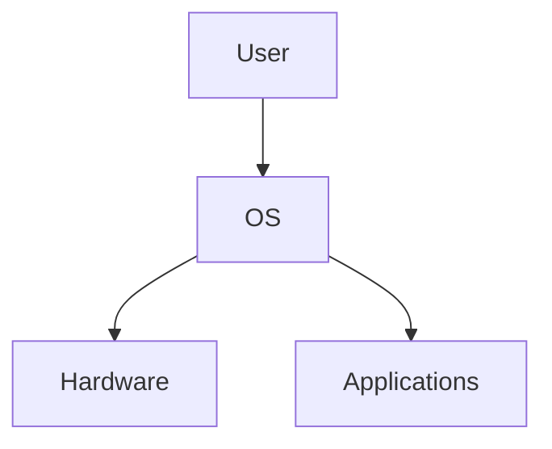

**Q:** What are the main roles of an OS?  
**A:** It acts as an intermediary between users and hardware, manages resources, provides user interfaces, and ensures security and efficiency.

**Explanation:** The OS ensures smooth operation by allocating resources, managing files, and providing a platform for applications.

**Q:** Classify operating systems.  
**A:** Types include **Batch**, **Interactive**, **Multiprogramming**, **Time Sharing**, **Real-Time**, **Multiprocessor**, and **Multithreaded** OS.

**Diagram (Mermaid):**
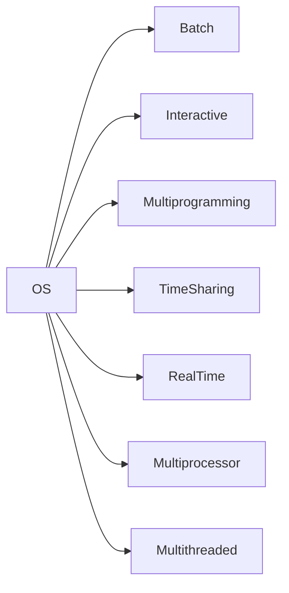

**Q:** What is a Batch OS?  
**A:** Batch OS executes batches of jobs with minimal user interaction, suitable for large data processing.

**Explanation:** Jobs are collected and processed together, reducing idle time but lacking immediate feedback.

**Q:** What is a Time Sharing OS?  
**A:** It allows multiple users to share system resources simultaneously, giving each user a time slice.

**Diagram (Mermaid):**
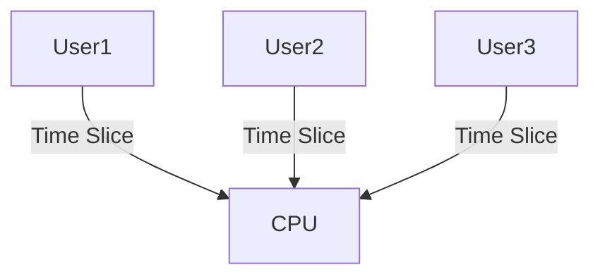

**Q:** What is System Protection in OS?  
**A:** It refers to mechanisms that prevent unauthorized access to resources and data.

**Explanation:** Protection ensures only authorized users and processes can access sensitive data and hardware.

**Q:** What are System Calls?  
**A:** System calls are interfaces for user programs to request services from the OS kernel, like file operations or process control.

**Diagram (Mermaid):**
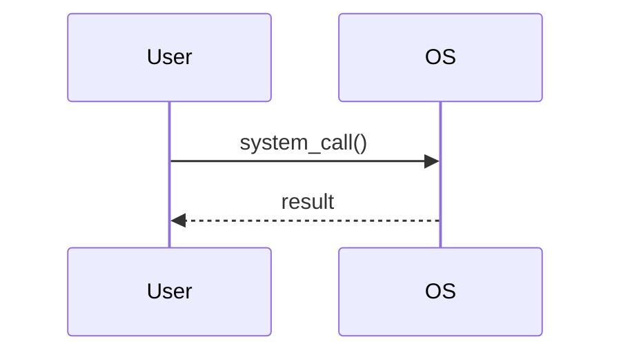

**Q:** What is a Reentrant Kernel?  
**A:** A reentrant kernel allows multiple processes to execute kernel code simultaneously without interference.

**Explanation:** Reentrancy enables safe concurrent execution, improving multitasking and system stability.

**Q:** Explain OS structures.  
**A:** OS structures include **Layered** (organized in layers), **Monolithic** (single large kernel), and **Microkernel** (minimal kernel, most services in user space).

**Diagram (Mermaid):**
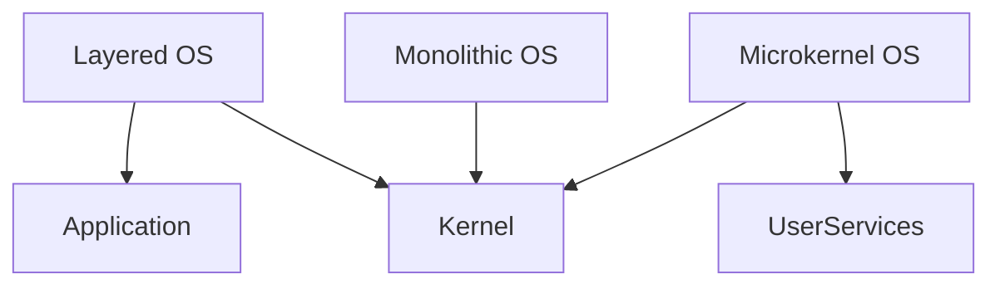

**Q:** What are the main OS components?  
**A:** Components include **Process Management**, **Memory Management**, **File System**, **Device Management**, and **Security**.

**Diagram (Mermaid):**
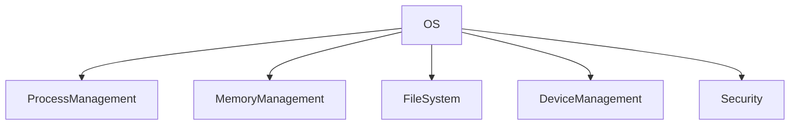

**Q:** What are the functions of an OS?  
**A:** Functions include resource allocation, process scheduling, memory management, I/O handling, and security.

**Explanation:** The OS coordinates all hardware and software activities, ensuring efficient and secure operation.

**Follow-up:** Can you name a real-world example of a microkernel OS?  
**A:** Yes, **QNX** and **Minix** are examples.

---

### 2. Processes

**Q:** What is a process?  
**A:** A process is a program in execution, with its own address space and resources.

**Explanation:** Each process runs independently, with its own memory and data, managed by the OS.

**Q:** What are the states of a process?  
**A:** States include **New**, **Ready**, **Running**, **Waiting/Blocked**, and **Terminated**.

**Diagram (Mermaid):**
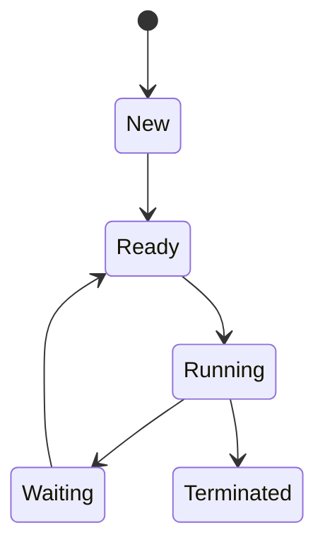

**Q:** Draw and explain the process state transition diagram.  
**A:**
```
New → Ready → Running → Waiting → Ready → Terminated
```
Processes move between these states based on scheduling and I/O events.

**Explanation:**
1. New: Process is being created.
2. Ready: Waiting to be assigned to CPU.
3. Running: Currently executing.
4. Waiting: Waiting for I/O or event.
5. Terminated: Finished execution.

**Q:** What is a Process Control Block (PCB)?  
**A:** PCB is a data structure containing process information like state, program counter, registers, and resources.

**Diagram (Mermaid):**
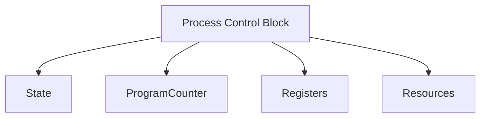

**Q:** What is process scheduling?  
**A:** It is the OS’s method of deciding which process runs next, using scheduling algorithms.

**Explanation:** Scheduling ensures fair and efficient use of CPU among processes.

**Q:** What is a thread?  
**A:** A thread is the smallest unit of CPU execution within a process; multiple threads can exist in one process.

**Diagram (Mermaid):**
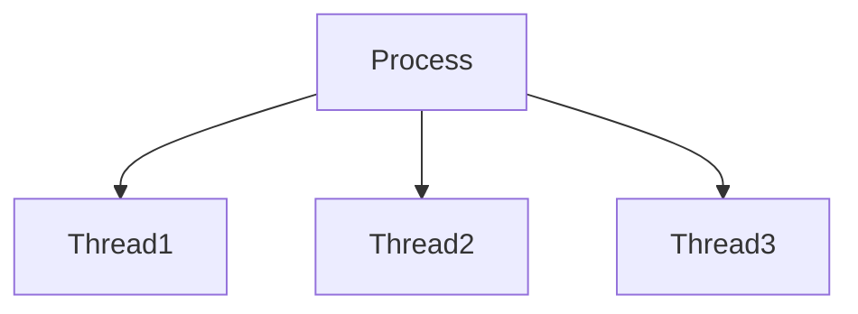

**Q:** How are threads managed?  
**A:** Threads are managed by the OS or user-level libraries, with context switching and synchronization.

**Explanation:** Thread management includes creation, scheduling, and synchronization to avoid conflicts.

**Follow-up:** What is the difference between a process and a thread?  
**A:** Processes have separate memory; threads share memory within a process.

---

### 3. CPU Scheduling

**Q:** What is CPU scheduling?  
**A:** CPU scheduling is the process of selecting which ready process will run next on the CPU.

**Diagram (Mermaid):**
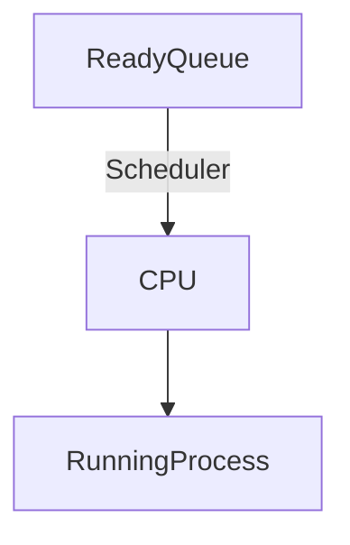

**Q:** What are performance criteria for scheduling?  
**A:** Criteria include **CPU utilization**, **throughput**, **turnaround time**, **waiting time**, and **response time**.

**Explanation:** These metrics help evaluate and compare scheduling algorithms for efficiency.

**Q:** Explain FCFS scheduling.  
**A:** **First-Come, First-Served (FCFS)** schedules processes in the order they arrive; simple but can cause long waiting times.

**Diagram (Mermaid):**
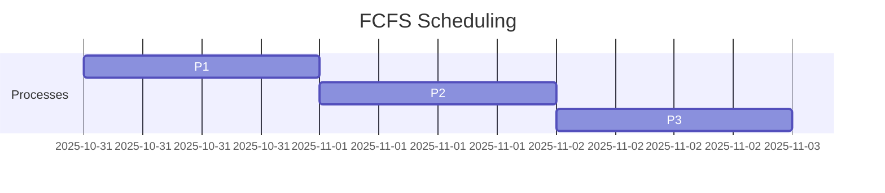

**Q:** What is SJF scheduling?  
**A:** **Shortest Job First (SJF)** runs the process with the shortest burst time next; optimal for average waiting time but hard to predict job length.

**Diagram (Mermaid):**
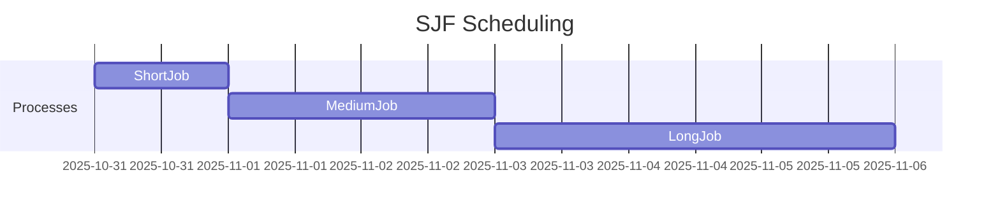

**Q:** What is Priority scheduling?  
**A:** Processes are assigned priorities; the highest priority process runs first.

**Explanation:** Priority scheduling can cause starvation for low-priority processes if high-priority ones keep arriving.

**Q:** What is Round Robin scheduling?  
**A:** Each process gets a fixed time slice in a cyclic order; good for time-sharing systems.

**Diagram (Mermaid):**
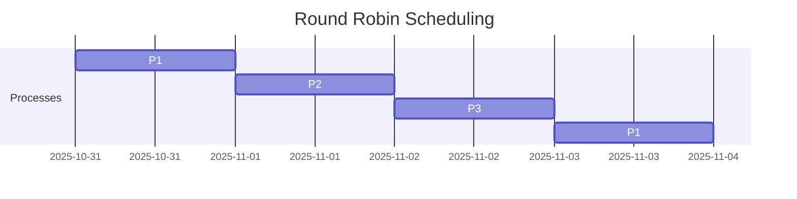

**Q:** What is a Multilevel Queue?  
**A:** Processes are divided into queues based on type, each with its own scheduling algorithm.

**Diagram (Mermaid):**
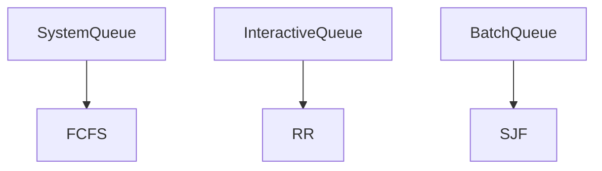

**Q:** What is Multilevel Feedback Queue?  
**A:** Similar to multilevel queue, but processes can move between queues based on their behavior.

**Explanation:** This allows dynamic adjustment, improving responsiveness and fairness.

**Q:** How is scheduling done in multiprocessor systems?  
**A:** Scheduling can be **asymmetric** (one scheduler) or **symmetric** (each processor schedules independently).

**Diagram (Mermaid):**
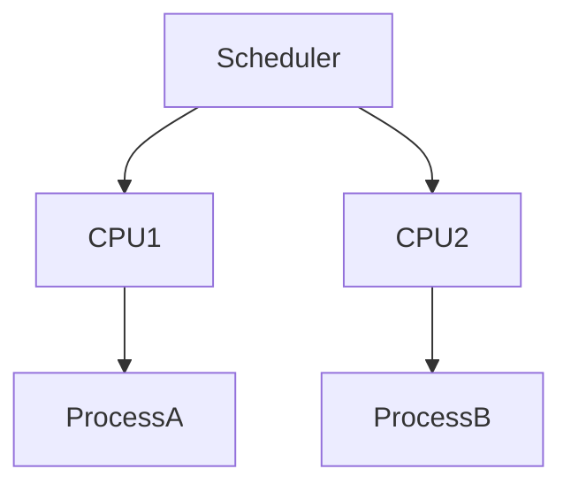

**Follow-up:** Why is Round Robin preferred in interactive systems?  
**A:** It ensures fair CPU time and quick response for all users.

---

### 4. Process Synchronization

**Q:** What is concurrency?  
**A:** Concurrency is the execution of multiple processes or threads simultaneously, possibly interacting.

**Diagram (Mermaid):**
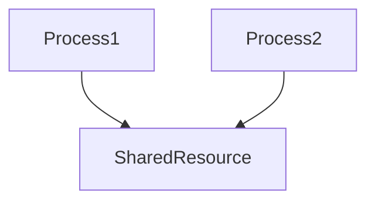

**Q:** How is concurrency implemented?  
**A:** Using constructs like **fork/join** and **parbegin/parend** to split and merge execution paths.

**Q:** What is Inter-process Communication (IPC)?  
**A:** IPC allows processes to exchange data and signals, using models like **message passing** or **shared memory**.

**Diagram (Mermaid):**
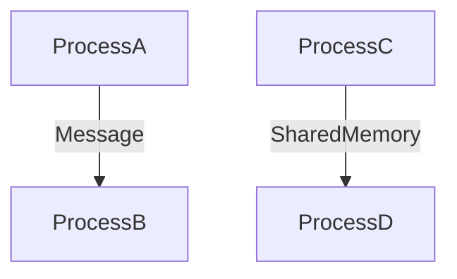

**Q:** Explain the Producer–Consumer problem.  
**A:** It models two processes sharing a buffer: the producer adds items, the consumer removes them, requiring synchronization.

**Diagram (Mermaid):**
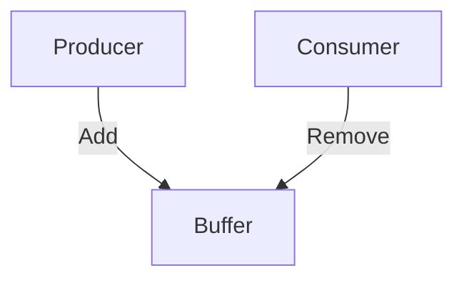

**Q:** What is the critical section problem?  
**A:** It’s the challenge of ensuring that only one process accesses shared resources at a time.

**Explanation:** Critical section code must be protected to avoid race conditions and data corruption.

**Q:** What is Dekker’s solution?  
**A:** Dekker’s algorithm is a software solution for mutual exclusion between two processes using flags and turn variables.

**Diagram (Mermaid):**
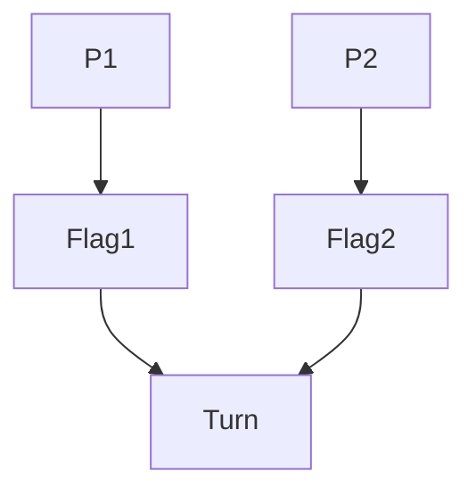

**Q:** What is Peterson’s solution?  
**A:** Peterson’s algorithm uses two flags and a turn variable for mutual exclusion, ensuring progress and bounded waiting.

**Explanation:** It is simple, works for two processes, and avoids busy waiting.

**Q:** What is a semaphore?  
**A:** A semaphore is a synchronization primitive, an integer variable used to control access to resources.

**Diagram (Mermaid):**
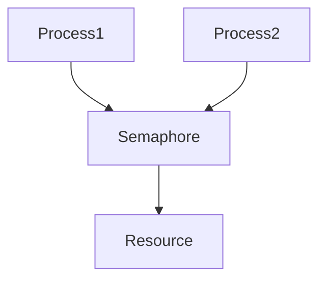

**Q:** What is synchronization hardware?  
**A:** Hardware instructions like **Test-and-Set** or **Compare-and-Swap** help implement mutual exclusion efficiently.

**Explanation:** These atomic instructions prevent race conditions by ensuring only one process modifies shared data at a time.

**Follow-up:** What is the difference between binary and counting semaphores?  
**A:** Binary semaphores are for mutual exclusion; counting semaphores manage multiple resources.

---

### 5. Classical Problems in Concurrency

**Q:** What is the Dining Philosopher Problem?  
**A:** It models philosophers sharing forks, illustrating resource allocation and deadlock in concurrent systems.

**Q:** What is the Readers–Writers Problem?  
**A:** It involves multiple readers and writers sharing data, focusing on synchronization to avoid conflicts.

**Q:** Why are these problems important?  
**A:** They help design and test synchronization solutions for real-world systems.

**Follow-up:** How can deadlock be avoided in Dining Philosopher Problem?  
**A:** By limiting resource allocation or using asymmetric solutions.

---

### 6. Deadlocks

**Q:** What is a deadlock?  
**A:** Deadlock is a situation where processes wait indefinitely for resources held by each other.

**Diagram (Mermaid):**
```mermaid
graph TD;
	P1 --> R1;
	P2 --> R2;
	R1 --> P2;
	R2 --> P1;
```

**Q:** What is the system model for deadlocks?  
**A:** It includes processes, resources, and their allocation and request graphs.

**Q:** What are the four necessary conditions for deadlock?  
**A:** **Mutual exclusion**, **hold and wait**, **no preemption**, and **circular wait**.

**Explanation:** All four must be present for deadlock to occur; breaking any one prevents deadlock.

**Q:** How can deadlocks be prevented?  
**A:** By breaking one of the necessary conditions, e.g., avoiding hold and wait.

**Q:** What is deadlock avoidance?  
**A:** It means ensuring the system never enters an unsafe state, e.g., using **Banker’s algorithm**.

**Q:** Explain Banker’s algorithm.  
**A:** It checks resource requests against available resources to ensure safe allocation and avoid deadlock.

**Diagram (Mermaid):**
```mermaid
flowchart TD
	Request --> CheckAvailable
	CheckAvailable --> SafeState{Safe?}
	SafeState -- Yes --> Allocate
	SafeState -- No --> Wait
```

**Q:** How is deadlock detected?  
**A:** By analyzing resource allocation graphs for cycles.

**Q:** How is deadlock recovered?  
**A:** By terminating or rolling back processes, or preempting resources.

**Q:** What is a combined approach to deadlocks?  
**A:** Using prevention, avoidance, and detection together for robust deadlock management.

**Follow-up:** Can you draw a simple resource allocation graph?  
**A:**
```
P1 → R1 → P2 → R2 → P1 (cycle shows deadlock)
```

---

## PART 2 — JAVA (Core + Programming Concepts)

### 1. Java Basics

**Q:** What is the difference between JVM, JRE, and JDK?  
**A:** **JVM** runs Java bytecode; **JRE** includes JVM plus libraries; **JDK** includes JRE plus development tools.

**Diagram (Mermaid):**
```mermaid
graph TD;
	JDK --> JRE;
	JRE --> JVM;
	JVM --> Bytecode;
```

**Q:** What is the Heap and Stack in Java memory?  
**A:** **Heap** stores objects; **Stack** stores method calls and local variables.

**Diagram (Mermaid):**
```mermaid
graph TD;
	Heap --> Objects;
	Stack --> MethodCalls;
	Stack --> LocalVariables;
```

**Q:** What are Java data types?  
**A:** Primitive types: int, float, char, boolean, etc.; Reference types: objects, arrays.

**Diagram (Mermaid):**
```mermaid
graph TD;
	DataTypes --> Primitive;
	DataTypes --> Reference;
	Primitive --> int;
	Primitive --> float;
	Primitive --> char;
	Primitive --> boolean;
	Reference --> Object;
	Reference --> Array;
```

**Q:** What is the difference between compile-time and runtime?  
**A:** Compile-time is when code is checked and converted to bytecode; runtime is when the program executes.

**Q:** What are wrapper classes?  
**A:** Wrapper classes (e.g., Integer, Double) wrap primitive types as objects.

**Q:** What is autoboxing and unboxing?  
**A:** Autoboxing converts primitives to objects automatically; unboxing does the reverse.

**Follow-up:** Why are wrapper classes needed?  
**A:** For using primitives in collections and generic classes.

---

### 2. OOPs Concepts

**Q:** What is a class and an object?  
**A:** A **class** is a blueprint; an **object** is an instance of a class.

**Q:** What is a constructor?  
**A:** A constructor initializes objects when they are created.

**Q:** What is encapsulation?  
**A:** Encapsulation means bundling data and methods, restricting direct access using access modifiers.

**Q:** What is inheritance?  
**A:** Inheritance allows a class to acquire properties and methods of another class.

**Q:** What is polymorphism?  
**A:** Polymorphism means one interface, many implementations; e.g., method overloading and overriding.

**Q:** What is abstraction?  
**A:** Abstraction hides complex details and shows only essential features.

**Q:** What is method overloading?  
**A:** Defining multiple methods with the same name but different parameters in a class.

**Diagram (Mermaid):**
```mermaid
classDiagram
	class Example {
		+void show(int a)
		+void show(double b)
	}
```

**Q:** What is method overriding?  
**A:** Redefining a superclass method in a subclass with the same signature.

**Diagram (Mermaid):**
```mermaid
classDiagram
	class Parent {
		+void display()
	}
	class Child {
		+void display()
	}
	Parent <|-- Child
```

**Q:** What are access modifiers?  
**A:** Keywords like **public**, **private**, **protected**, and **default** that control visibility.

**Q:** What is the difference between static and non-static?  
**A:** **Static** members belong to the class; **non-static** belong to objects.

**Q:** What is the use of final, this, and super?  
**A:** **final** prevents modification; **this** refers to current object; **super** refers to superclass.

**Q:** Difference between interface and abstract class?  
**A:** Interface has only abstract methods; abstract class can have both abstract and concrete methods.

**Follow-up:** Can a class implement multiple interfaces?  
**A:** Yes, Java supports multiple interface implementation.

---

### 3. Arrays & Strings

**Q:** What is a 1D array?  
**A:** A linear collection of elements of the same type, accessed by index.

**Diagram (Mermaid):**
```mermaid
graph TD;
	Array[1D Array] --> Element0;
	Array --> Element1;
	Array --> Element2;
```

**Q:** What is a 2D array?  
**A:** An array of arrays, used to represent matrices or tables.

**Diagram (Mermaid):**
```mermaid
graph TD;
	Array2D[2D Array] --> Row1;
	Array2D --> Row2;
	Row1 --> Col1;
	Row1 --> Col2;
	Row2 --> Col1;
	Row2 --> Col2;
```

**Q:** Difference between String, StringBuilder, and StringBuffer?  
**A:** **String** is immutable; **StringBuilder** is mutable and not thread-safe; **StringBuffer** is mutable and thread-safe.

**Diagram (Mermaid):**
```mermaid
classDiagram
	class String {
		-immutable
	}
	class StringBuilder {
		-mutable
		-not thread-safe
	}
	class StringBuffer {
		-mutable
		-thread-safe
	}
```

**Q:** How do you reverse a string in Java?  
**A:** Use `StringBuilder(str).reverse().toString()`.

**Q:** How to check if a string is a palindrome?  
**A:** Compare characters from both ends or use `reverse()` and check equality.

**Q:** How to find substring in a string?  
**A:** Use `str.substring(start, end)` method.

**Q:** How to count frequency of characters in a string?  
**A:** Use a HashMap to store and count occurrences.

**Follow-up:** Why is String immutable?  
**A:** For security, thread safety, and performance optimization.

---

### 4. Collections Framework

**Q:** What is ArrayList?  
**A:** ArrayList is a resizable array implementation in Java Collections.

**Diagram (Mermaid):**
```mermaid
classDiagram
	class ArrayList {
		-dynamic size
		-index access
	}
```

**Q:** What is LinkedList?  
**A:** LinkedList stores elements as nodes linked together; good for frequent insertions/deletions.

**Diagram (Mermaid):**
```mermaid
classDiagram
	class LinkedList {
		-nodes
		-next pointer
	}
```

**Q:** What is HashMap?  
**A:** HashMap stores key-value pairs, allowing fast access using hashing.

**Diagram (Mermaid):**
```mermaid
classDiagram
	class HashMap {
		-buckets
		-hash function
		-key-value pairs
	}
```

**Q:** What is HashSet?  
**A:** HashSet stores unique elements, backed by a HashMap.

**Diagram (Mermaid):**
```mermaid
classDiagram
	class HashSet {
		-unique elements
		-backed by HashMap
	}
```

**Q:** What is TreeMap?  
**A:** TreeMap stores key-value pairs in sorted order using a Red-Black tree.

**Diagram (Mermaid):**
```mermaid
classDiagram
	class TreeMap {
		-sorted order
		-Red-Black tree
	}
```

**Q:** What is LinkedHashMap?  
**A:** LinkedHashMap maintains insertion order of key-value pairs.

**Diagram (Mermaid):**
```mermaid
classDiagram
	class LinkedHashMap {
		-insertion order
		-key-value pairs
	}
```

**Q:** How does HashMap work internally?  
**A:** It uses hashing to store keys in buckets; handles collisions using linked lists or trees.

**Diagram (Mermaid):**
```mermaid
graph TD;
	HashMap --> Bucket1;
	HashMap --> Bucket2;
	Bucket1 --> LinkedList;
	Bucket2 --> Tree;
```

**Q:** What is load factor in HashMap?  
**A:** Load factor determines when to resize the HashMap; default is 0.75.

**Explanation:** When the number of entries exceeds 75% of bucket capacity, HashMap resizes to maintain performance.

**Q:** What is an Iterator?  
**A:** Iterator is an object to traverse collections one element at a time.

**Diagram (Mermaid):**
```mermaid
graph TD;
	Iterator --> Element1;
	Iterator --> Element2;
	Iterator --> Element3;
```

**Q:** How is for-each loop used?  
**A:** For-each loop simplifies iteration over arrays and collections.

**Diagram (Mermaid):**
```mermaid
graph TD;
	ForEach --> Array;
	ForEach --> Collection;
```

**Follow-up:** Can HashMap have null keys?  
**A:** Yes, HashMap allows one null key.

---

### 5. Algorithm & Logic Concepts

**Q:** What is the two-pointer approach?  
**A:** Using two indices to solve problems efficiently, like searching or partitioning arrays.

**Diagram (Mermaid):**
```mermaid
graph TD;
	Array --> Pointer1;
	Array --> Pointer2;
```

**Q:** What is the sliding window technique?  
**A:** Moving a window of fixed or variable size over data to solve problems like subarray sums.

**Diagram (Mermaid):**
```mermaid
graph TD;
	Array --> Window;
	Window --> Subarray;
```

**Q:** How does binary search work?  
**A:** It repeatedly divides a sorted array in half to find a target value; time complexity is O(log n).

**Diagram (Mermaid):**
```mermaid
graph TD;
	Array --> Mid;
	Mid --> Left;
	Mid --> Right;
```

**Q:** What is the time complexity of binary search?  
**A:** O(log n).

**Q:** Name some sorting algorithms.  
**A:** Bubble sort, selection sort, insertion sort, merge sort, quick sort.

**Diagram (Mermaid):**
```mermaid
graph TD;
	Sorting --> BubbleSort;
	Sorting --> SelectionSort;
	Sorting --> InsertionSort;
	Sorting --> MergeSort;
	Sorting --> QuickSort;
```

**Q:** Which sorting algorithm is fastest in practice?  
**A:** Quick sort is generally fastest for large datasets.

**Follow-up:** When is merge sort preferred?  
**A:** When stable sorting and large data are required.

---

### 6. Miscellaneous Java Topics

**Q:** What is regex?  
**A:** Regex (regular expression) is a pattern used to match and manipulate strings.

**Diagram (Mermaid):**
```mermaid
graph TD;
	Regex --> Pattern;
	Pattern --> Match;
	Pattern --> Replace;
```

**Q:** Give a use case for regex.  
**A:** Validating email addresses or searching for patterns in text.

**Q:** What is exception handling in Java?  
**A:** It is managing runtime errors using try-catch-finally blocks.

**Q:** Difference between throw and throws?  
**A:** **throw** is used to explicitly throw an exception; **throws** declares exceptions in method signature.

**Q:** What is multithreading?  
**A:** Multithreading is running multiple threads concurrently for better resource utilization.

**Q:** How to create a thread in Java?  
**A:** By extending `Thread` class or implementing `Runnable` interface.

**Q:** What is synchronization?  
**A:** Synchronization controls access to shared resources to prevent conflicts.

**Q:** What is garbage collection?  
**A:** Automatic memory management that frees unused objects.

**Q:** What are packages and imports?  
**A:** Packages organize classes; imports bring classes into scope.

**Follow-up:** Why is finally block used?  
**A:** To execute code regardless of exception occurrence, usually for cleanup.

---

> **Tip:** Practice answering aloud, focus on key terms, and use diagrams for process flows and algorithms. Good luck!

---

# ✨ Advanced & Tricky Viva Questions

## PART 1 — OPERATING SYSTEM (Extended)

### 1. Introduction (Advanced)

**Q:** What is the difference between a kernel and a shell?  
**A:** The **kernel** is the core part of the OS managing hardware; the **shell** is the user interface to interact with the OS.

**Q:** Why is protection important in OS design?  
**A:** It prevents accidental or malicious access to resources, ensuring system stability and security.

**Q:** What is the role of interrupts in OS?  
**A:** Interrupts signal the CPU to stop current tasks and handle urgent events, improving responsiveness.

**Q:** How does a microkernel improve reliability?  
**A:** By running most services in user space, faults are isolated, reducing system crashes.

**Follow-up:** What is a trap?  
**A:** A trap is a software-generated interrupt, often used for system calls.

---

### 2. Processes (Advanced)

**Q:** What is context switching?  
**A:** Context switching is saving the state of one process and loading another, allowing multitasking.

**Q:** What information is stored in a PCB?  
**A:** Process state, program counter, CPU registers, memory management info, I/O status, and accounting info.

**Q:** What is process starvation?  
**A:** When a process never gets CPU time due to scheduling policies.

**Q:** How does the OS prevent starvation?  
**A:** By using aging, which gradually increases the priority of waiting processes.

**Follow-up:** What is a zombie process?  
**A:** A zombie process has finished execution but still has an entry in the process table.

---

### 3. CPU Scheduling (Advanced)

**Q:** What is preemptive vs non-preemptive scheduling?  
**A:** **Preemptive** allows interruption of running processes; **non-preemptive** lets processes run until completion or waiting.

**Q:** What is starvation in Priority scheduling?  
**A:** Low-priority processes may never execute if high-priority ones keep arriving.

**Q:** Draw a Gantt chart for Round Robin scheduling.  
**A:**
```
P1 | P2 | P3 | P1 | P2 | P3 ... (each gets a time slice)
```

**Q:** How does time quantum affect Round Robin performance?  
**A:** Too small increases context switches; too large reduces responsiveness.

**Follow-up:** What is turnaround time?  
**A:** Total time taken from process submission to completion.

---

### 4. Process Synchronization (Advanced)

**Q:** What is busy waiting?  
**A:** Continuously checking a condition in a loop, wasting CPU cycles.

**Q:** How do semaphores avoid busy waiting?  
**A:** By blocking processes until resources are available, instead of looping.

**Q:** What is a race condition?  
**A:** When multiple processes access shared data and the outcome depends on the order of execution.

**Q:** How does hardware support synchronization?  
**A:** Atomic instructions like **Test-and-Set** ensure operations complete without interruption.

**Follow-up:** What is spinlock?  
**A:** A lock where a process repeatedly checks until it acquires the lock; causes busy waiting.

---

### 5. Classical Problems in Concurrency (Advanced)

**Q:** What is starvation in Dining Philosopher Problem?  
**A:** When a philosopher never gets both forks and cannot eat.

**Q:** How does the Readers–Writers problem handle writer priority?  
**A:** By blocking new readers if a writer is waiting, ensuring writers are not starved.

**Follow-up:** Can you write a simple pseudocode for mutual exclusion using semaphores?  
**A:**
```
wait(mutex);
// critical section
signal(mutex);
```

---

### 6. Deadlocks (Advanced)

**Q:** What is resource allocation graph?  
**A:** A directed graph showing processes and resources; cycles indicate possible deadlocks.

**Q:** How does preemption help in deadlock recovery?  
**A:** By forcibly taking resources from processes to break deadlocks.

**Q:** What is safe state in Banker’s algorithm?  
**A:** A state where resources can be allocated without risk of deadlock.

**Q:** What is wait-for graph?  
**A:** A simplified resource allocation graph showing which processes are waiting for others.

**Follow-up:** What is deadlock detection frequency?  
**A:** How often the OS checks for deadlocks; frequent checks increase overhead.

---

## PART 2 — JAVA (Extended)

### 1. Java Basics (Advanced)

**Q:** What is type casting in Java?  
**A:** Converting one data type to another, e.g., int to double or vice versa.

**Q:** What is the default value of object references?  
**A:** `null`.

**Q:** What is the difference between == and .equals()?  
**A:** `==` checks reference equality; `.equals()` checks value/content equality.

**Q:** What is the role of the `main` method?  
**A:** It is the entry point for Java applications; signature is `public static void main(String[] args)`.

**Follow-up:** Can we overload the main method?  
**A:** Yes, but only the standard signature is used by JVM to start execution.

---

### 2. OOPs Concepts (Advanced)

**Q:** What is constructor overloading?  
**A:** Defining multiple constructors with different parameters in a class.

**Q:** What is the use of `super()` in constructors?  
**A:** It calls the parent class constructor.

**Q:** What is the difference between compile-time and runtime polymorphism?  
**A:** Compile-time is method overloading; runtime is method overriding.

**Q:** What is the use of private constructors?  
**A:** To restrict object creation, often used in singleton patterns.

**Q:** Can abstract class have constructors?  
**A:** Yes, but cannot be instantiated directly.

**Follow-up:** What is marker interface?  
**A:** An interface with no methods, used to mark classes for special behavior (e.g., Serializable).

---

### 3. Arrays & Strings (Advanced)

**Q:** How do you sort an array in Java?  
**A:** Use `Arrays.sort(array)` method.

**Q:** How to convert a string to an integer?  
**A:** Use `Integer.parseInt(str)`.

**Q:** What is string interning?  
**A:** Storing only one copy of each distinct string value in the string pool.

**Q:** How to split a string by a delimiter?  
**A:** Use `str.split(delimiter)`.

**Q:** How to compare two strings ignoring case?  
**A:** Use `str1.equalsIgnoreCase(str2)`.

**Follow-up:** What is the output of `"abc" == new String("abc")`?  
**A:** `false`, because they are different objects.

---

### 4. Collections Framework (Advanced)

**Q:** What is the difference between ArrayList and Vector?  
**A:** Vector is synchronized (thread-safe); ArrayList is not.

**Q:** How does TreeSet store elements?  
**A:** In sorted order, using a Red-Black tree.

**Q:** What is fail-fast behavior in iterators?  
**A:** Iterator throws `ConcurrentModificationException` if collection is modified during iteration.

**Q:** How to remove duplicates from a list?  
**A:** Convert list to a `Set` or use streams.

**Q:** What is the difference between HashMap and Hashtable?  
**A:** Hashtable is synchronized and does not allow null keys/values; HashMap is not synchronized and allows one null key.

**Follow-up:** What is the use of `Collections.unmodifiableList()`?  
**A:** It returns a read-only view of the list.

---

### 5. Algorithm & Logic Concepts (Advanced)

**Q:** What is recursion?  
**A:** A method calling itself to solve smaller instances of a problem.

**Q:** What is the difference between linear and binary search?  
**A:** Linear search checks each element; binary search divides the array and checks halves.

**Q:** What is the space complexity of merge sort?  
**A:** O(n), due to extra space for merging.

**Q:** How do you detect a cycle in a linked list?  
**A:** Use Floyd’s cycle-finding algorithm (two pointers).

**Q:** What is the difference between stable and unstable sorting?  
**A:** Stable sorting preserves the order of equal elements; unstable does not.

**Follow-up:** Give an example of a stable sort.  
**A:** Merge sort is stable.

---

### 6. Miscellaneous Java Topics (Advanced)

**Q:** What is the difference between checked and unchecked exceptions?  
**A:** Checked exceptions are checked at compile-time; unchecked at runtime.

**Q:** What is the use of `finally` block?  
**A:** Executes code after try-catch, regardless of exception.

**Q:** How do you create a custom exception?  
**A:** Extend the `Exception` class and define your own methods.

**Q:** What is the difference between Thread and Runnable?  
**A:** Thread is a class; Runnable is an interface for defining thread behavior.

**Q:** What is the purpose of `synchronized` keyword?  
**A:** It ensures only one thread accesses a block of code at a time.

**Q:** How does garbage collector work?  
**A:** It automatically frees memory by removing unreachable objects.

**Q:** What is the use of `import static`?  
**A:** Allows static members to be used without class qualification.

**Follow-up:** What is the default package in Java?  
**A:** The unnamed package, used when no package is specified.

---

# 🗂️ Oral Exam Tips & Diagrams

## OS Process State Diagram
```
		+-------+
		|  New  |
		+-------+
			|
			v
		+-------+
		| Ready |
		+-------+
			|
			v
		+--------+
		|Running |
		+--------+
		 /     \
		v       v
   +--------+  +----------+
   |Waiting |  |Terminated|
   +--------+  +----------+
```

## Java Memory Model
```
+-------------------+
|   Method Area     |
+-------------------+
|      Heap         |
+-------------------+
|      Stack        |
+-------------------+
| Program Counter   |
+-------------------+
| Native Method Stk |
+-------------------+
```

## Oral Exam Tips
- Speak clearly and confidently.
- Use key terms and short definitions.
- Draw diagrams for process flows and algorithms.
- If unsure, explain your reasoning step-by-step.
- Relate answers to real-world examples when possible.

---

**You are now prepared for both conceptual and tricky viva questions. Review, practice aloud, and best of luck!**

---

# Deep Dives, Worked Examples & Code Snippets

This section adds practical depth: worked examples, short pseudocode, and compact Java snippets you can explain verbally in a viva.

## OS — Deep Dives & Worked Examples

### Process Control Block (PCB) — Fields you should mention
- **Process ID (PID)** — unique identifier
- **Process state** — new/ready/running/waiting/terminated
- **Program counter** — address of next instruction
- **CPU registers** — saved during context switch
- **CPU scheduling info** — priority, scheduling queue pointers
- **Memory management info** — base/limit registers or page table pointer
- **Accounting info** — CPU used, start time
- **I/O status info** — list of open devices

When asked about PCB, name 4–6 fields quickly, then add "used by the scheduler and context-switch routine".

### Context Switch — Stepwise (short, oral style)
1. Save CPU registers and program counter into current process's PCB.
2. Update process state (running → ready or waiting).
3. Choose next process from ready queue (scheduler runs).
4. Load registers and program counter from chosen PCB.
5. Switch to user mode and resume execution.

### Scheduling metrics — formulas you can say aloud
- Turnaround time = Finish time − Arrival time
- Waiting time = Turnaround time − Burst time
- Response time = Time of first CPU allotment − Arrival time

Example (3 processes, FCFS) — say this in viva step-by-step:

Processes: P1(arrival=0,burst=4), P2(arrival=1,burst=3), P3(arrival=2,burst=2)

FCFS Gantt (time slots): P1[0-4] | P2[4-7] | P3[7-9]

- Turnaround: P1=4−0=4, P2=7−1=6, P3=9−2=7
- Waiting: P1=4−4=0, P2=6−3=3, P3=7−2=5

You can quickly compute averages when asked for average waiting/turnaround.

### Deadlock — Banker’s algorithm (mini worked example)
Suppose 2 resource types (R1,R2) and 3 processes P0,P1,P2 with Max and Allocation tables.

Max:
P0: (7,5)
P1: (3,2)
P2: (9,0)

Allocation:
P0: (0,1)
P1: (2,0)
P2: (3,0)

Available: (3,3)

Safe-sequence check (explain quickly): find a process whose Need = Max−Allocation ≤ Available. If found, pretend to allocate and release, repeat. If a full ordering exists → safe.

Explain that in viva as: "Banker checks safety by simulating allocations — if the system can finish all processes, the state is safe." Mention complexity O(m*n^2) for m resources and n processes (optional).

### Producer–Consumer (bounded buffer) — Pseudocode (semaphore style)
```
semaphore mutex = 1;
semaphore empty = N; // N slots
semaphore full = 0;

producer() {
	wait(empty);
	wait(mutex);
	// add item to buffer
	signal(mutex);
	signal(full);
}

consumer() {
	wait(full);
	wait(mutex);
	// remove item from buffer
	signal(mutex);
	signal(empty);
}
```

Explain in viva: "empty counts free slots, full counts filled slots, mutex protects critical section — no busy waiting here because wait blocks."

### Peterson’s Algorithm — Short explanation + code-like sketch
```
flag[0]=flag[1]=false; turn=0;
// process i wants to enter
flag[i]=true; turn=1-i;
while(flag[1-i] && turn==1-i) ; // busy wait
// critical section
flag[i]=false;
```
Mention constraints: works for two processes, relies on atomic reads/writes, ensures mutual exclusion, progress and bounded waiting.

## Java — Practical Snippets & Explanations

### equals() vs == — quick demo to say aloud
```
String s1 = "abc"; 
String s2 = new String("abc");
s1 == s2; // false (reference)
s1.equals(s2); // true (value)
```
Explain: `==` checks reference identity, `.equals()` checks logical equality (overrideable).

### Simple class + constructor + polymorphism example
```java
class Animal { void speak(){ System.out.println("...animal..."); } }
class Dog extends Animal { @Override void speak(){ System.out.println("bark"); } }
// In viva: show how runtime polymorphism calls Dog.speak if reference points to Dog
```

### Thread creation — two quick ways
```java
// 1. Extend Thread
class T1 extends Thread { public void run(){ System.out.println("run"); } }

// 2. Implement Runnable
class R1 implements Runnable { public void run(){ System.out.println("run"); } }
Thread t = new Thread(new R1()); t.start();
```
Explain differences: implementing Runnable separates task from thread, allows reuse and multiple inheritance of types.

### Custom exception (short)
```java
class MyException extends Exception {
	MyException(String msg){ super(msg); }
}
// throw new MyException("error");
```

### HashMap internals — concise explanation to deliver verbally
- HashMap uses a hash function on the key to map to a bucket index.
- Buckets hold a linked list (or tree for many collisions) of entries.
- On put(), HashMap computes index, checks entries in bucket, updates existing key or appends new entry.
- When size > capacity*loadFactor, it resizes (rehashes).

When asked about collision resolution, say: "Java 8 uses linked lists transformed to balanced trees for long chains to keep performance." Mention default load factor 0.75 and why resizing matters.

### String reverse & palindrome — quick Java snippet to recite
```java
String reverse(String s){
	return new StringBuilder(s).reverse().toString();
}
boolean isPal(String s){
	return s.equals(reverse(s));
}
```

## Quick Revision Cheat-Sheet (one-liners for oral recall)
- OS: Kernel = resource manager; Shell = user interface.
- PCB: stores process state, PC, registers, memory info, I/O list.
- Deadlock conditions: mutual-exclusion, hold-and-wait, no-preemption, circular-wait.
- Semaphore: wait() decreases, signal() increases; binary vs counting.
- Scheduling metrics: turnaround, waiting, response, throughput, CPU util.
- Java: JVM executes bytecode; JDK includes compiler; JRE bundles runtime libs.
- String: immutable; use StringBuilder for heavy mutation.
- Collections: HashMap — buckets, load factor, rehash; TreeMap — ordered.

## 20 Rapid-Fire Mock Viva Questions (practice aloud)
1. What is the difference between process and program?  
2. Define PCB and name three fields.  
3. Explain the purpose of system calls.  
4. Give one advantage of microkernel design.  
5. Why does context switching have overhead?  
6. Write steps to compute average waiting time for FCFS.  
7. How does Round Robin improve response time?  
8. What is busy waiting and why avoid it?  
9. Give pseudocode for producer-consumer using semaphores.  
10. State four necessary conditions for deadlock.  
11. What is a safe state in Banker’s algorithm?  
12. JVM vs JRE vs JDK — quick difference.  
13. Explain autoboxing with an example.  
14. When to use StringBuilder vs StringBuffer?  
15. How does HashMap handle collisions?  
16. Explain fail-fast vs fail-safe iterators.  
17. Describe two-pointer technique with an example problem.  
18. What's the time complexity of QuickSort average and worst case?  
19. How would you create and catch a custom exception?  
20. Explain synchronized keyword and one alternative for concurrency control.

For each question, practice a 2–4 line answer. The goal is clarity and correct key terms.
